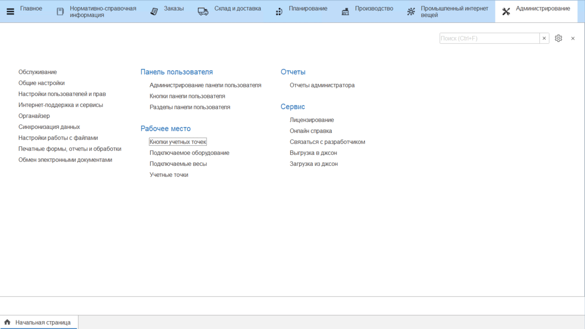
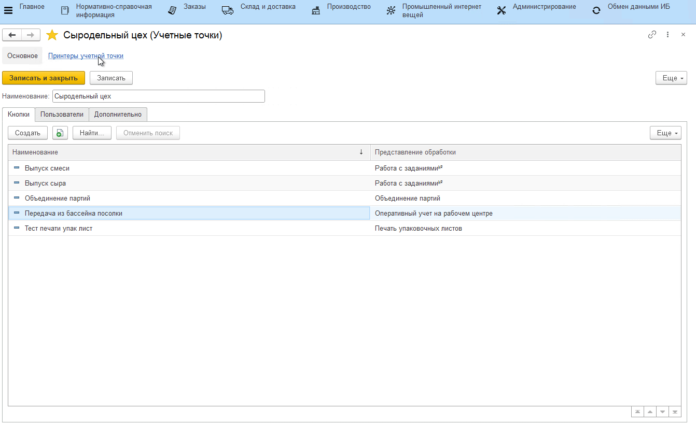

# Учетные точки

Данный справочник используется для того, чтобы отделить наборы операций, выполняемых на разных участках склада.

Для создания учетной точки необходимо:

- открыть справочник **"Учетные точки"** и перейти к созданию нового элемента;
- указать **наименование**;
- указать **список пользователей**, у которых будет доступ к этой учетной точке (т.е. только они смогут выполнять операции, относящиеся к этой учетной точке);
- нажать **"Записать и закрыть"**.

### Принтеры учетной точки

Для каждой учетной точки можно настроить список принтеров, которые физически к ней подключены, и обозначить соответствие между принтером и типом документа/этикетки, который на нем печатается. Например, для печати этикеток к учетной точке подключен термопринтер, а для печати упаковочных листов подключен лазерный принтер.

Для создания соответствия необходимо:

- перейти на закладку *"Принтеры учетной точки"*;
- перейти к созданию нового элемента регистра;
- в открывшейся форме указать, для печати чего используется принтер - можно выбрать макет или шаблон этикетки (для шаблона этикетки обязательно заполнение поля "Назначение");
- выбрать принтер из списка всех доступных на устройстве принтеров.

Так же на форме можно провести тестовую печать в соответствии с выбранными параметрами. Затем необходимо нажать **"Записать и закрыть"**. При работе на киоске документы, выбранные в настройках кнопок учетных точек, будут печататься на те принтеры, которые указаны в регистре "Принтеры учетных точек". 