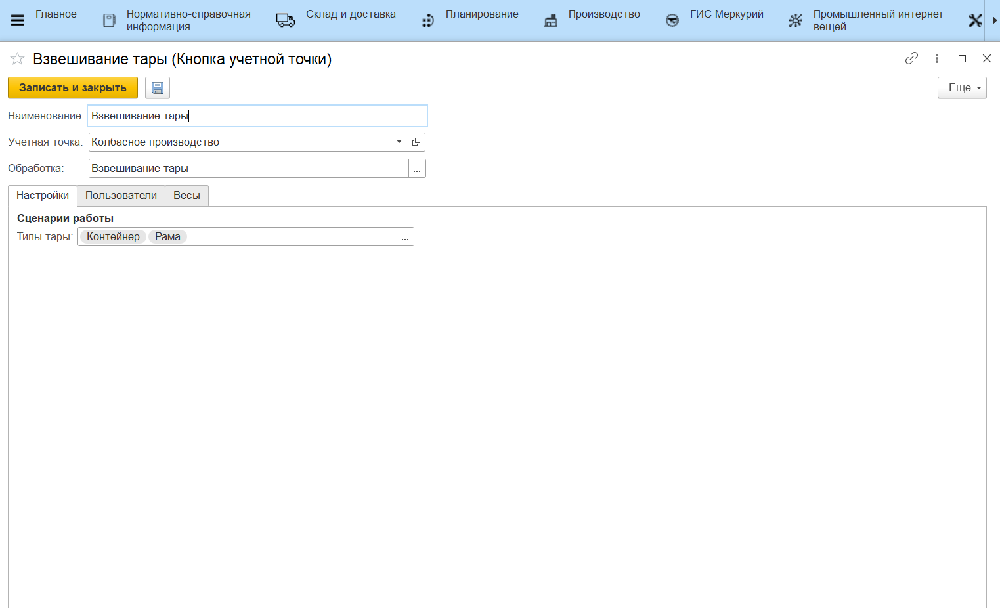

# Взвешивание тары

Для обновления веса тар из справочника **"Тары"** через киоски. Пример - [мойка тары](../../Manufacture/Cheese/SemiHardCheese/ContainerWashing.md).

- *Тип тары* - с тарами данных типов можно будет проводить операцию перевзвешивания.

В результате работы в этой кнопке учетной точке на киоске в элементах справочника **"Тары"** изменяется вес и дата последнего завешивания.

Также, есть регистр сведений для отслеживания истории изменения веса тары **"Взвешивания тары"**.