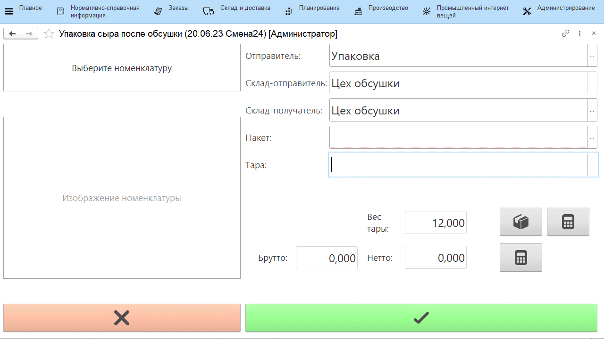

# Оперативный учет на рабочем центре

Работа с остатками на выбранном складе через киоски: перемещение, выпуски и прочие операции.

## Создаваемые документы

- **Переработка** или **Переработка (брак)** - допускается выбор только одного значения - выпустить по кнопке можно либо бракованную продукцию, либо хорошую. 
    
    | Блок | Параметр | Описание | Возможные значения |
    |----------|---------|---------|-------|
    | Создаваемые документы | Выпускать брак отдельной номенклатурой | Виден, если создается документ брака. При установке в истину по кнопке всегда будет выпускаться указанная номенклатура | Да/Нет |
    |  | Номенклатура выпуска брака | Виден, если стоит признак выпуска брака отдельной номенклатурой | Элемент справочника "Номенклатура" |
    |  | Вид номенклатуры выпуска брака | Виден, если создается документ брака и нет признака выпуска брака отдельной номенклатурой | Элемент справочника "Виды номенклатуры" |
    |  | Характеристика выпуска брака | Если у номенклатуры или у вида номенклатуры включен учет по характеристикам, то здесь нужно указать, какая из них отвечает за брак | Элемент справочника "Характеристики номенклатуры" |
    | Варианты распределения | Основные материалы. Количество | Правила для списания количества основного материала | По выпуску, выбранный материал - из какого остатка выпускаем, тот и берется, в количестве = выпуску |
    |  | Основные материалы. партии | Правила для подбора партий для списания основного материала | По выпуску = партия равна партии выпуска |
    |   | Вспомогательные материалы. Количество | Правила для списания количества вспомогательных материалов | Либо по норме, либо никак |
    | | Вспомогательные материалы. партии | Правила для подбора партий для списания вспомогательных материалов |
    | Сценарии работы | Разрешить выпуск побочной продукции | Включает/отключает выпуск из выбранного материала не только основной продукции, но еще и побочки (пример - выпуск сливок, обрата из молока помимо смеси) |
    | | Разрешить выпуск в упаковках | Позволяет указывать объем выпуска в упаковках (с автоматическим пересчетом на штуки) |
    | | Указывать пакеты | Применяется, когда выпускаемая продукция упаковывается еще и в пакеты |
    | | Учет остатков по таре | Ставится, когда продукция выпускается на таре и дальше прослеживается в разрезе этой тары | В разрезе контейнеров - если у тары нет фиксированного  номера,  а каждый раз присваивается новый   В разрезе тары + указание, какой именно - если у тары есть фиксированный номер |
    | | Типы тары | Отображается, когда стоит учет в разрезе тары. Ограничивает список выбора тар в АРМе - будут доступны только с указанными типами |
    | | Указывать вес тары | Завешивание идет на таре. чтобы получить точный вес продукции нужно из общего веса вычитать вес тары |
    | | Выпускать на таре материала | Если включен, то выпуск всегда будет идти на таре материала без возможности изменить это ||
    | | Использовать калькулятор тары | Можно указать вес тары в виде составных частей с заданным в системе фиксированным весом (см.ниже "Пример 2") |
    | | Типы тары для калькулятора | Отображается, когда включено использование калькулятора тары. Ограничивает список типов тар в калькуляторе |
    | | Создавать одну партию на смену | Включает/отключает создание только одной выпускаемой партии для любой продукции в указанную смену.  Каждый следующий выпуск той же номенклатуры будет либо с новой партией, либо с одной и той же |
    | Значения по умолчанию | Рабочий центр | Участок, на котором учитываются выпуски |
    | | Склады для выбора | Ограничивает список складов для выпуска |
    | | Склад-отправитель\|Ячейка-отправитель | Откуда берется основной материал |
    | | Склад-получатель\|Ячейка-получатель | Куда выпускается продукция |
    | | Упаковка | Задает, какой единицей измерения будет ограничен выбор упаковок в форме выпуска (см.ниже "Пример 1") |
    | Параметры печати | Печать сразу на принтер | Включает/отключает печать сразу на принтер. Включенная опция позволяет печатать выбранный документ без предварительного вывода на экран |

- **Перемещение** - позволяет через киоск указывать факт перемещения продукции между складами. Используется для формирования документа "Распоряжение на перемещение".

    | Блок | Параметр | Описание |
    |----------|---------|---------|
    | Создаваемые документы | Со взвешиванием | Позволяет через киоск отразить перемещение тары/партии, изменяя перемещаемое количество. Если опция не включена, выбранное на киоске количество остатка будет перемещено полностью без возможности перевзвешивания |
    | Сценарии работы | Указывать вес тары | Завешивание происходит на таре. Чтобы получить точный вес продукции нужно из общего веса вычитать вес тары |
    | | Использовать калькулятор тары | Отображается, когда включено указание веса тары. Можно указать вес тары в виде составных частей с заданным в системе фиксированным весом |
    | | Типы тары для калькулятора | Отображается, когда включено использование калькулятора тары. Ограничивает список типов тар в калькуляторе |
    | | Фиксировать ответственных с двух сторон | При подтверждении перемещения на киоске необходимо сканирование бейджей ответственных за операцию со склада-отправителя и склада-получателя |
    | Значения по умолчанию | Склады для выбора | Ограничивает список складов для перемещения |
    | | Склад-отправитель | Откуда перемещается продукция |
    | | Склад-получатель | Куда перемещается продукция |
    | Параметры печати | Печать сразу на принтер | Включает/отключает печать сразу на принтер. Включенная опция позволяет печатать выбранный документ без предварительного вывода на экран |

## Примеры

**Пример 1**

**Пример 2**

## Связанные документы

- **Переработка + Упаковочный лист** - для учета выпуска на паллету (или другую тару) с необходимостью печатать информацию, идентифицирующую продукцию на ней.

    | Блок | Параметр | Описание |
    |----------|---------|---------|
    | Создаваемые документы | Тип тары | С каким типом тары будет создаваться документ "Упаковочный лист" |
    | Значения по умолчанию | Организация | Текущая организация |
    | Параметры печати | Макет (Упаковочный лист) | Что именно будет печататься на паллету |

- **Переработка + Комплектация тары** - для учета выпуска и формирования соответствующего документа, куда попадают указанные при выпуске тара, её состав (например, полки, рамы) и продукция, которая помещается на эту тару.

    | Блок | Параметр | Описание | Возможные значения |
    |----------|---------|---------|------|
    | Создаваемые документы | Переупаковка | Сценарий переупаковки продукции. Если будет включена опция указания пакетов, то по кнопке: - остаток, лежавший на таре, с неё снимается - указанный остаток той же Н/Х/С кладется на новую тару, если включена опция учета по таре  - указанные пакеты списываются документом распределения |
    | Сценарии работы | Разрешить выпуск в упаковках | Позволяет указывать объем комплектуемой продукции в упаковках (с автоматическим пересчетом на штуки) |
    | | Указывать пакеты | Применяется, когда комплектуемая продукция упаковывается еще и в пакеты |
    | | Учет остатков по таре | Ставится, когда продукция комплектуется на тару и дальше прослеживается в разрезе этой тары | В разрезе контейнеров - если у тары нет фиксированного номера, а каждый раз присваивается новый;   В разрезе тары + указание, какой именно - если у тары есть фиксированный номер |
    | | Типы тары | Отображается, когда стоит учет в разрезе тары. Ограничивает список выбора тар в АРМе - будут доступны только с указанными типами |
    | | Указывать вес тары | Завешивание идет на таре. Чтобы получить точный вес продукции нужно из общего веса вычитать вес тары |
    | | Использовать калькулятор тары | Можно указать вес тары в виде составных частей с заданным в системе фиксированным весом |
    | | Типы тары для калькулятора | Отображается, когда включено использование калькулятора тары. Ограничивает список типов тар в калькуляторе |
    | Значения по умолчанию | Склады для выбора | Ограничивает список складов для комплектации |
    | | Склад-отправитель | Откуда берется основной материал |
    | | Склад-получатель | Куда перемещается укомплектованная продукция |
    | | Упаковка | Задает, какой единицей измерения будет ограничен выбор упаковок в форме комплектации (Приемка и передача) |
    | Параметры печати | Печать сразу на принтер | Включает/отключает печать сразу на принтер. Включенная опция позволяет печатать выбранный документ без предварительного вывода на экран |

- **Переработка + Задание на перемещение** - для формирования документа "Задание на перемещение". Позволяет на киоске сформировать задание на перемещение выбранной тары. 

    | Блок | Параметр | Описание | Возможные значения |
    |----------|---------|---------|------|
    | Сценарии работы | Учет остатков по таре | Ставится, когда продукция выпускается на таре и дальше прослеживается в разрезе этой тары | В разрезе контейнеров - если у тары нет фиксированного  номера,  а каждый раз присваивается новый   В разрезе тары + указание, какой именно - если у тары есть фиксированный номер |

- **Перемещение со взвешиванием + Упаковочный лист** - для учета перемещения продукции на паллетах (или другой таре) с необходимостью печатать информацию, идентифицирующую продукцию на ней. Формируются документы "Распоряжение на перемещение" и "Упаковочный лист".

    | Блок | Параметр | Описание |
    |----------|---------|---------|
    | Создаваемые документы | Тип тары | С каким типом тары будет создаваться документ "Упаковочный лист" |
    | Сценарии работы | Указывать вес тары | Завешивание происходит на таре. Чтобы получить точный вес продукции нужно из общего веса вычитать вес тары |
    | | Использовать калькулятор тары | Отображается, когда включено указание веса тары. Можно указать вес тары в виде составных частей с заданным в системе фиксированным весом |
    | | Типы тары для калькулятора | Отображается, когда включено использование калькулятора тары. Ограничивает список типов тар в калькуляторе |
    | | Фиксировать ответственных с двух сторон | При подтверждении перемещения на киоске необходимо сканирование бейджей ответственных за операцию со склада-отправителя и склада-получателя |
    | | Выбирать тип перемещения | Позволяет выбирать тип перемещения на киоске - [полное](../../Manufacture/Meat/PalletMoving/FullMoving.md) или [частичное без перевзвешивания](../../Manufacture/Meat/PalletMoving/PartMoving.md) |
    | Значения по умолчанию | Склады для выбора | Ограничивает список складов для перемещения |
    | | Склад-отправитель | Откуда перемещается продукция |
    | | Склад-получатель | Куда перемещается продукция |
    | | Организация | Текущая организация |
    | Параметры печати | Печать сразу на принтер | Включает/отключает печать сразу на принтер. Включенная опция позволяет печатать выбранный документ без предварительного вывода на экран |
    | | Макет (Упаковочный лист) | Что именно будет печататься на паллету |

- **Перемещение + Переработка** - создает документ выпуска и документ перемещения, при этом выпуск идет на "Склад-отправитель", а перемещение на "Склад-получатель".
- **Перемещение/Задание на перемещение + Переработка + Комплектация тары** - создает документ выпуска, документ перемещения и документ комплектации тары, при этом выпуск идет на "Склад-отправитель", на "Складе-отправителе" выпуск комплектуется на указанную тару, а затем укомплектованная тара перемещается на "Склад-получатель".