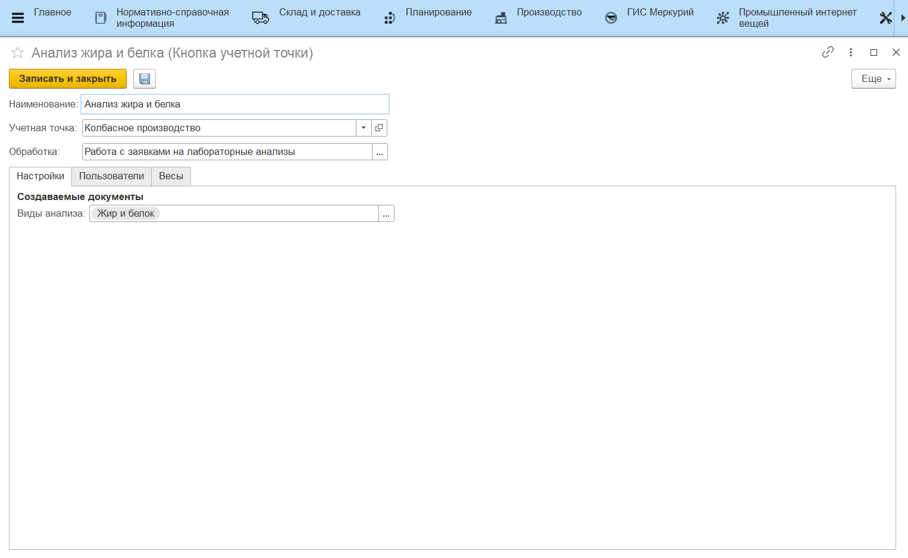

# Работа с заявками на лабораторные анализы

Работа через киоски с документами **"Заявка на анализ номенклатуры"** и **"Анализ номенклатуры"**.

- *Виды анализа* - список видов анализа номенклатуры, заявки по которым будут отображаться в АРМе.

При открытии кнопки учетной точки из **"Меню учетных точек"**, на форме отображаются заявки, плановая дата которых равна указанной дате смены.