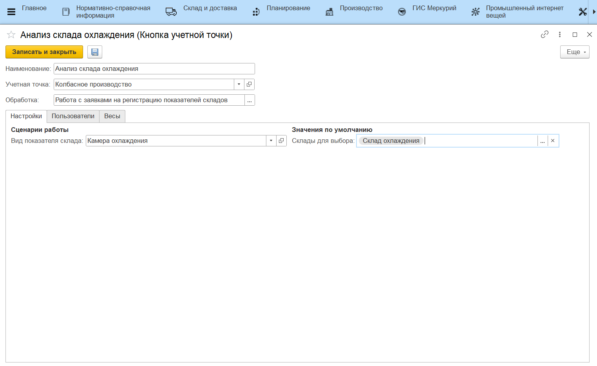

# Работа с заявками на регистрацию показателей складов

Работа с документом **"Заявка на регистрацию показателей складов"** через киоски.

-   Вид показателя склада - заявки на какой вид показателей отображать в АРМе;
-   Склады для выбора - по каким складам отображать заявки.

При открытии кнопки учетной точки из **"Меню учетных точек"**, на форме отображаются заявки на регистрацию показателей складов, плановая дата которых равна указанной дате смены.