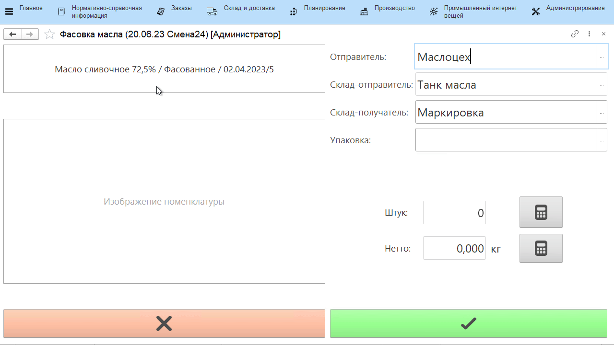
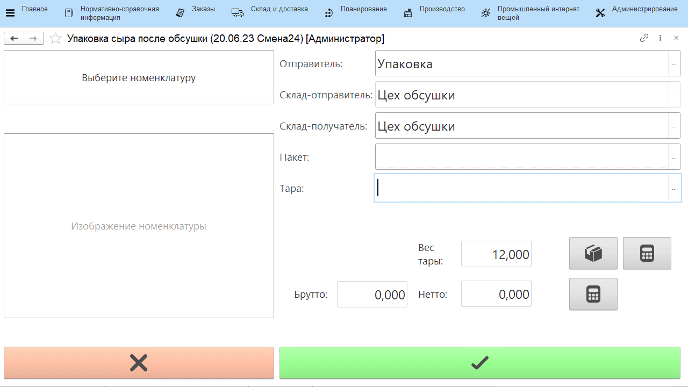
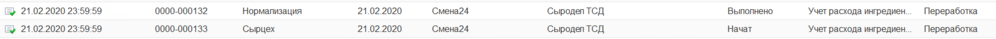
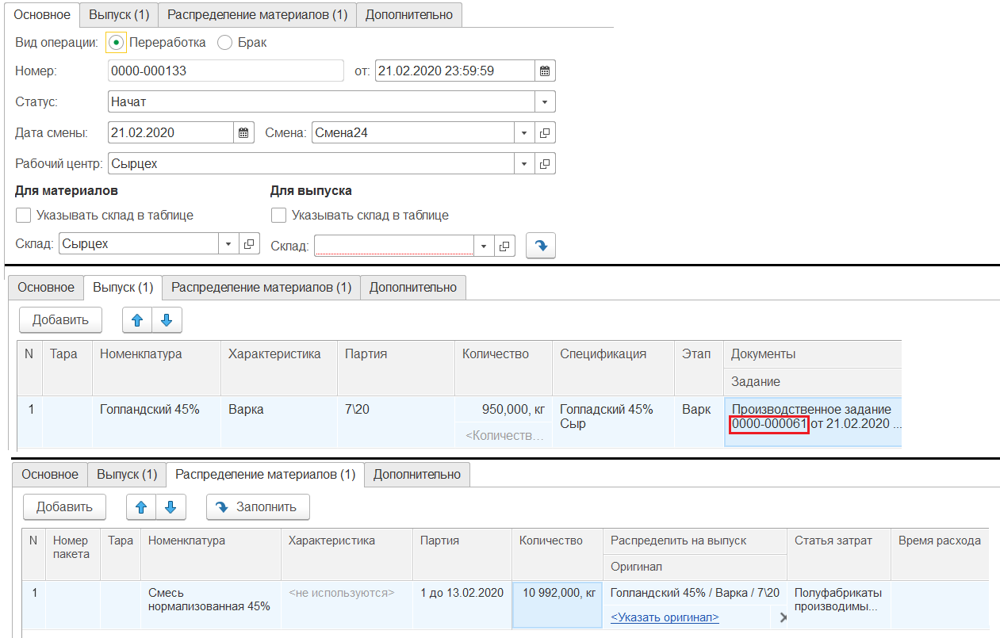

# Работа с заданиями

Работа с документом "Производственное задание" через киоски и ТСД.

## Создаваемые документы

- **Переработка** или **Переработка (брак)** - допускается выбор
    только одного значения - выпустить по кнопке можно либо бракованную
    продукцию, либо хорошую. Общие параметры для разных сценариев
    документа:

| Блок | Параметр | Описание | Возможные значения |
|----|----|---|---|
| Видимость кнопок | Выпуск | Отображает кнопку для учета выпуска продукции в форме с заданием | |
| Сценарии работы | Разрешить выпуск в упаковках  | Позволяет указывать объем    выпуска в упаковках (с автоматическим пересчетом на штуки) | |
| | Упаковка | Задает, какой единицей измерения будет ограничен выбор упаковок в форме выпуска (см. ниже "Пример 1" - Приемка и передача) | |
| | Разрешить несколько выпусков по одному заданию | Выпуск по одной строке задания можно указывать несколькими "порциями". При этом появляется кнопка завершения строки задания | |
| | Выпуск несколькими документами | Каждая "порция" выпуска фиксируется новым документом "Переработка", даже если это одна строка задания | |
| | Указывать пакеты | Применяется, когда выпускаемая продукция упаковывается еще и в пакеты| |
| | Учет остатков по таре | Ставится, когда продукция выпускается на таре и дальше прослеживается в разрезе этой тары | В разрезе контейнеров - если у тары нет фиксированного номера, а каждый раз присваивается новый   В разрезе тары - если у тары есть фиксированный номер (дополнительно требует указания типа тары)   В разрезе тары (справочно) - указание конкретной тары выпуска на киоске становится не обязательным, но обязательно зафиксировать вес тары с весов. Если дополнительно включено "Использовать калькулятор тары", то указание состава тары также становится необязательным. Если выпуск все-таки был выполнен на конкретной таре, но на складе (отправителе и/или получателе) не ведется учет по таре, то контроль остатков и местонахождения в разрезе тары не будут выполняться |
| | Типы тары | Отображается, когда стоит учет в разрезе тары. Ограничивает список выбора тар в АРМе - будут доступны только с указанными типами | |
| | Указывать вес тары | Завешивание идет на таре, чтобы получить точный вес продукции нужно из общего веса вычитать вес тары| |
| | Использовать калькулятор тары | Можно указать вес тары в виде составных частей с заданным в системе фиксированным весом (см. ниже "Пример 2")||
| | Выпускать на таре материала | Если включен, то выпуск всегда будет идти на таре материала без возможности изменить это ||
| | Типы тары для калькулятора | Отображается, когда включено использование калькулятора тары. Ограничивает список типов тар в калькуляторе | |
| Значения по умолчанию | Рабочий центр | Участок, на который выдается задание| |
| | Склады для выбора | Ограничивает список складов для выпуска | |
| | Склад-отправитель \| Ячейка-отправитель | Откуда берется основной материал. Если задать значение, то в наборке (см. ниже) он не будет виден через киоск, в остальных - заполнен при открытии | |
| | Склад-получатель \| Ячейка-получатель | Куда выпускается продукция. Если задать значение, то в наборке (см. ниже) он не будет виден через киоск, в остальных - заполнен при открытии| |
| Параметры печати | Печать сразу на принтер | Включает\\отключает печать сразу на принтер, без вывода на экран | |
| Оборудование | Автовзешивание | Включает\\отключает режим, при котором можно не получать вес с весов, каждый раз нажимая кнопку на форме, а один раз запустить автовзвешивание, после чего поочередно класть продукцию на весы.  Каждый "устаканившийся" вес будет равен новому завешиванию в АРМе.| |

Предполагается три сценария работы с документом **"Переработка"**:  

| Сценарий | Описание | Параметр | Описание параметра |
|-----|-----|-----|------|
| Выполнять наборку по рецептуре | Под каждую строку задания осуществляется наборка ингредиентов по спецификации | Выводить плановый вес наборки | На форме наборки по рецептуре показывает поле "Плановый вес", значение в котором подсказывает, какой вес должен получиться на весах при завешивании выбранного ингредиента с учетом веса тары и набранных ингредиентов. `Плановый вес набираемого ингредиента = план. вес ингредиента + вес тары + вес предыдущего ингредиента, уже набранного на эту же тару (если есть).` |
|  |  | Завершать выпуск | Включен - при завершении наборки формируется документ "Переработка" в статусе "Выполнено"   Количество выпускаемой продукции = общему весу указанных в наборке ингредиентов   Не включен - статус "Начато", количество выпуска и склад не заполняются |
|  |  | Выпускать с весом основного материала | Включен - при завершении наборки с завершением выпуска вес выпуска равен весу основного материала и только |
| | | Подбирать партию материала по FIFO | Для материалов при открытии по остаткам на складе-отправителе подбираются партии в соответствие с правилами FIFO |
| | | Контроль сырья по FEFO | Включает/отключает проверку расхода партий материалов. Если у пользователя нет права на использование более "свежих" (с более поздним сроком годности) партий при наличии остатков менее "свежих", то ему будет выдано либо предупреждение, либо запрет на использование |
| | | Минимальный учитываемый остаток | Количество, меньше которого можно не использовать менее "свежие" партии |
| | | Указывать основной материал | Помимо вспомогательных материалов, указывается основной. Если параметр не включен, то можно выбрать один из стандартных вариантов распределения для основного материала. Основной материал нельзя будет указать при наборке через учетную точку, но он попадет в созданную переработку |
| | | Печатать этикетки пакетов | Включает/отключает печать этикеток пакетов |
| Указывать расход ингредиентов | Под каждую строку задания осуществляется фактическое указание ингредиентов, использованных при производстве | Указывать основной материал | Помимо вспомогательных материалов, указывается основной. Если параметр не включен, то можно выбрать один из стандартных вариантов распределения для основного материала. Основной материал нельзя будет указать при наборке через учетную точку, но он попадет в созданную переработку |
| | | Создавать выпуск основного материала | Доступен, если стоит предыдущий пункт   Помимо списания материала на строку задания, создается также еще  выпуск материала - в случае, если основное производственное задание имеется связанное, его обеспечивающее   По итогу указания основного материала формируются два документа "Переработка", в первом - основной материал (и остальные указанные) списывается на строку задания, во втором - этот основной материал выпускается по связанному заданию (см. ниже "Пример 3") |
| | | Видимость кнопок "Расход ингредиентов" | Делает доступной кнопку для указания расхода ингредиентов |
| | | Пересчитывать основной материал в килограммы | Если включено, то при вводе количества основного материала в АРМе будет считаться, что указываются литры, и будет идти пересчет в килограммы. Требует наличия анализа по показателю плотности, указанному в константах, а также, чтобы у материала была вторая единица измерения, указанная в параметре ниже. |
| | | Единица измерения литры | Задает, в какой единице измерения ведется учет литров |
| | | Пересчитывать  норму ингредиентов по основному материалу | Нормативы ингредиентов рассчитываются на основании введенного количества основного материала в соответствие с рецептурой |
| Отсутствие галочек по наборке и учету ингредиентов | Позволяет указывать выпуск продукции по заданию с или без списания материалов по норме | Основные материалы. Количество | Правило для списания количества основного материала:  По выпуску, выбранный материал - списывается выбранная партия остатка, в количестве равном количеству выпуска  По норме на выпуск - количество списания рассчитывается согласно спецификации  Все остатки - списываются все остатки основного материала по спецификации на складе-отправителе  Все остатки по выбранному материалу - полностью списывается выбранная партия остатка на складе-отправителе |
|  |  | Основные материалы. партии | Правило для подбора партий при списании:  По выпуску - партия основного материала равна партии выпуска  По ФЕФО - первыми выбираются партии с самым ранним заканчивающимся сроком годности  По ФИФО - первыми выбираются партии, пришедшие на склад раньше  В порядке выбора - связан с параметром "Указывать несколько партий материалов"  Пропорционально остаткам - Списывается каждая партия остатка основного материала на складе-отправителе. Общее нормативное количество списания материала распределяется между партиями пропорционально количеству их остатка на складе-отправителе |
| | | Вспомогательные материалы. Количество | Правило для списания количества вспомогательных материалов:  Либо по норме, либо никак |
| | | Вспомогательные материалы. партии | Правило для подбора партий при списании:  По ФЕФО - первыми выбираются партии с самым ранним заканчивающимся сроком годности  По ФИФО - первыми выбираются партии, пришедшие на склад раньше  Пропорционально остаткам - Списывается каждая партия остатка вспомогательного материала на складе-отправителе. Общее нормативное количество списания материала распределяется между партиями пропорционально количеству их остатка на складе-отправителе |
| | | Указывать несколько партий материалов | Используемые при выпуске партии материалов сканируются в АРМе приемки и передачи. Списание идет в порядке сканирования (т.е. если указано два основных материала, нужное количество списывается с первого, затем,при нехватке добирается вторым) |

- **Указывать параметры тех.процесса** - создает документ "Анализ номенклатуры", значения которого вводятся в сенсорной форме. "Вид анализа" - заявки на какой вид анализа будут отображаться в АРМе. При этом важно понимать, что в сенсорной форме отобразятся только те заявки, которые связаны с продукцией из производственного задания на указанный рабочий центр.

- Если включены опции **Упаковочный лист**, **Комплектация тары** или **Задание на перемещение**, то по завершении выпуска помимо документа Переработка, сформируются и выбранные документы. 

- **Перемещение + Переработка** - создает документ выпуска и документ перемещения, при этом выпуск идет на "Склад-отправитель", а перемещение на "Склад-получатель".

!!! info "Важно"

    Сценарий выпуска с перемещением **невозможен** в случае, когда для кнопки учетной точки настроен выпуск на таре (учет остатков по таре = "в разрезе тары" или "в разрезе тары (справочно)") и при этом на складе-отправителе не ведется учет по таре. 

## Примеры

**Пример 1**

**Пример 2**

**Пример 3**

Два Производственных задания:

Документ, сформированный по первому Производственному заданию:

Документ, сформированный по второму Производственному заданию:

