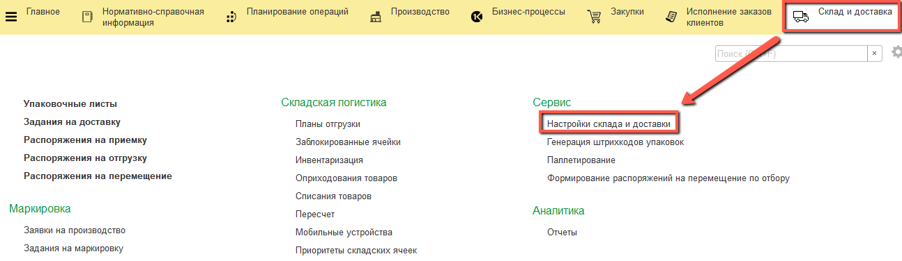
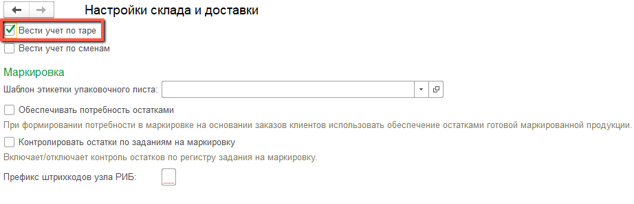
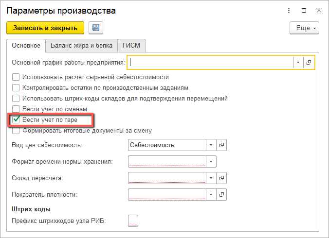
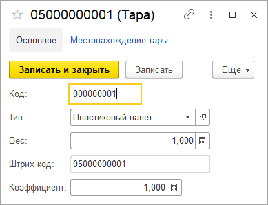
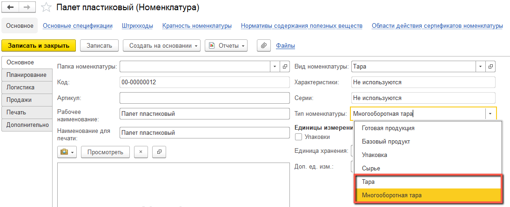
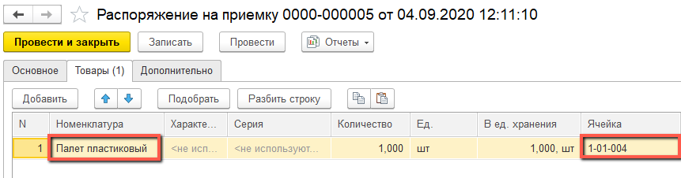
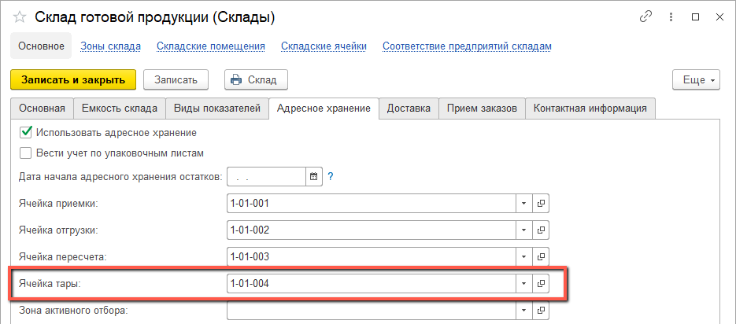
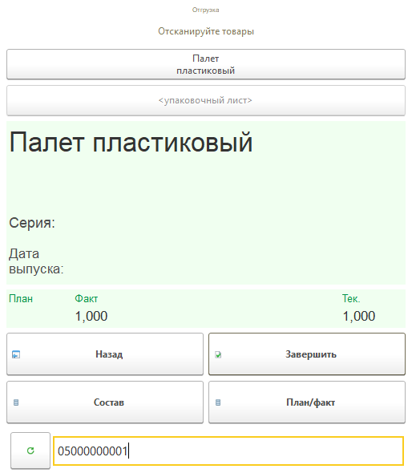
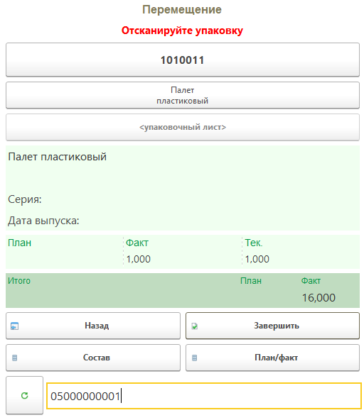
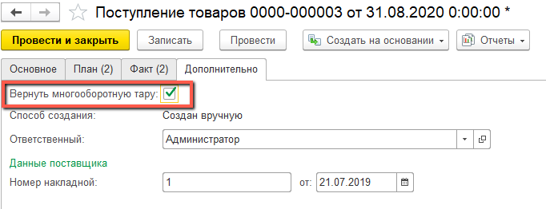

# Тара

В справочнике **"Тары"** хранится список тар. Для использования тар в системе необходимо установить константу **"Вести учет по таре"**, сделать это можно в настройках склада и доставки

или в настройках производства

При создании тары указываются:

- Код (заполняется автоматически)
- Тип тары
- Вес
- Коэффициент
- Штрихкод - формируется автоматически при записи тары

Реквизит тип тары - элемент справочника **"Типы тар"**, для каждого элемента указываются:

- Код (заполняется автоматически)
- Наименование
- Использование в упаковочных листах
    - Если используется, то указывается цифра расширения SSCC
    - Если не используется, то указывается номенклатура
- Вес

Указывается номенклатура у которой установлен тип **"Тара"** или **"Многооборотная тара"**:

При приемке/перемещении/отгрузке тары на складе при сканировании штрихкода тары в складской документ попадает номенклатура, указанная для тары в типе тары. Операция для тары осуществляется в/из ячейки тары на складе, если на нем используется адресное хранение.

Приемка:

Ячейка в которую принята тара является ячейкой тары:

Отгрузка:

Перемещение:

При продаже товаров клиенту тара может быть продана вместе с товаром, а может быть позже возвращена покупателем, тогда клиент за нее не платит и её стоимость не попадает в сумму реализации. Для возвращаемой тары тип номенклатуры должен быть установлен **Многооборотная тара**, а в *"Реализации товаров"* на вкладке *"Дополнительно"* установлен признак **"Вернуть многооборотную тару"**

Аналогично при закупках товаров тара может быть многооборотной и возвращаемой, поэтому не участвовать в расчетах с контрагентом. В *"Поступлении товаров"* должен быть установлен признак **"Вернуть многооборотную тару"**:

Для отражения отгрузок и поступлений номенклатуры, которая является тарой используется документ **"Корректировка долга тары"**, для него указываются:

На вкладке **"Основное"**

- Номер (заполняется автоматически)
- Дата
- Тип корректировки:
    - Увеличение долга - тара списывается на контрагента
    - Списание долга
- [Организация](Organization.md)
- [Подразделение](Department.md)
- [Холдинг](Holding.md)
- [Контрагент](Contractor.md)
- [Точка доставки](DeliveryPoint.md)

На вкладке **"Товары"**

Список номенклатуры для которой установлен тип **"Многооборотная тара"**. Заполняется номенклатура, её характеристика, количество, упаковка.

Отчет **"Баланс многооборотной тары"** отражает какие многооборотные тары и в каком количестве были отгружены контрагенту или получены от него за определенный период времени:

