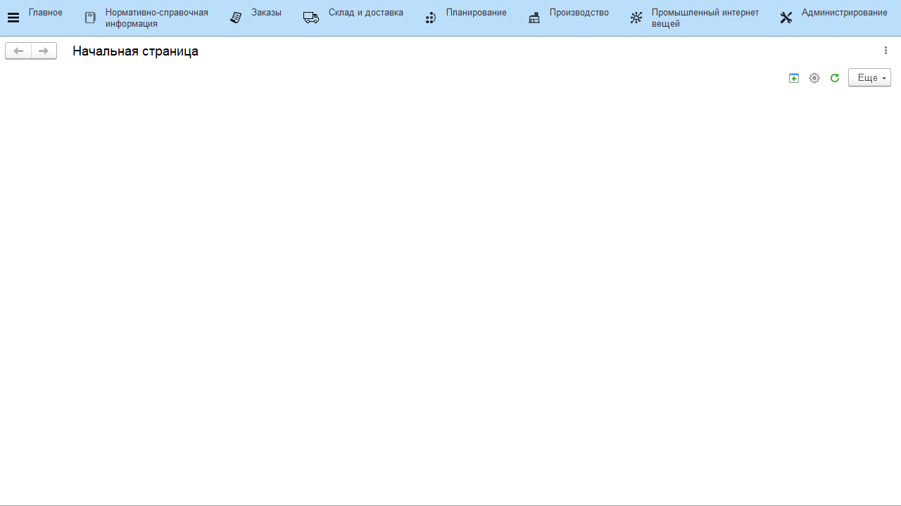
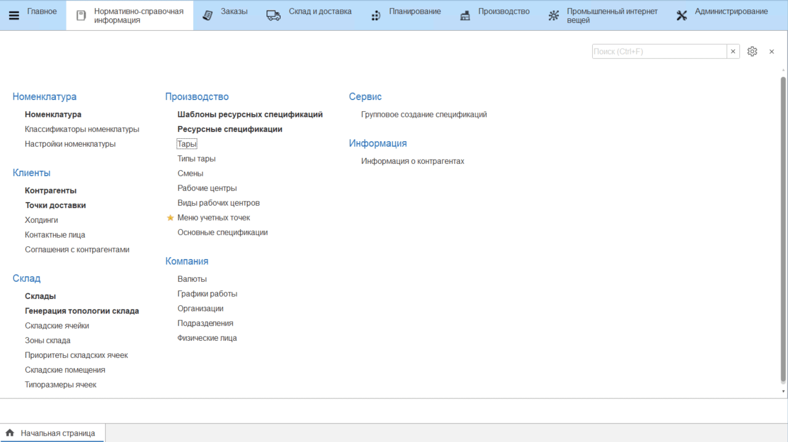
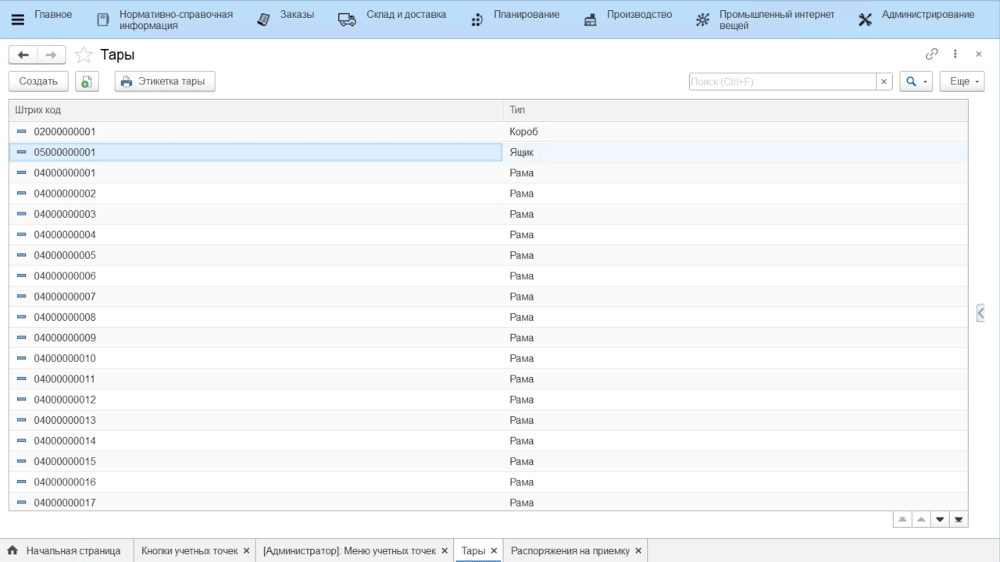
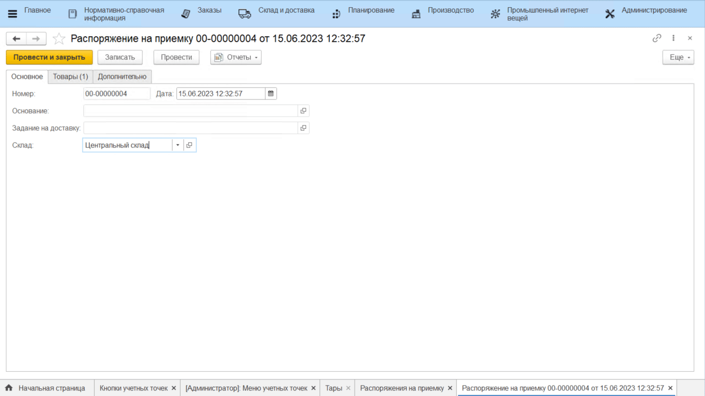

# Тара

В справочнике **"Тары"** хранится список тар. Для использования тар в системе необходимо установить константу **"Вести учет остатков на таре и местоположения тары"**. Сделать это можно в "Настройках склада и доставки" или в "Настройках параметров учета":

## НСИ

При создании тары указываются:

- Код (заполняется автоматически)
- Тип тары
- Вес
- Коэффициент
- Штрихкод - формируется автоматически при записи тары

Реквизит **Тип тары** - элемент справочника **"Типы тар"**, для каждого элемента указываются:

- Код (заполняется автоматически)
- Наименование
- Использование в упаковочных листах
    - Если используется, то указывается цифра расширения SSCC
    - Если не используется, то можно указать номенклатуру, у которой установлен тип **"Тара"**
- Вес

## Складские операции

При приемке/перемещении/отгрузке тары на складе при сканировании штрихкода тары в складской документ попадает номенклатура, указанная для тары в типе тары. Операция для тары осуществляется в/из ячейки тары на складе, если на нем используется адресное хранение.

Приемка:

Ячейка, в которую принята тара, является ячейкой тары:

Работа с отгрузкой и перемещением ведется аналогичным образом.