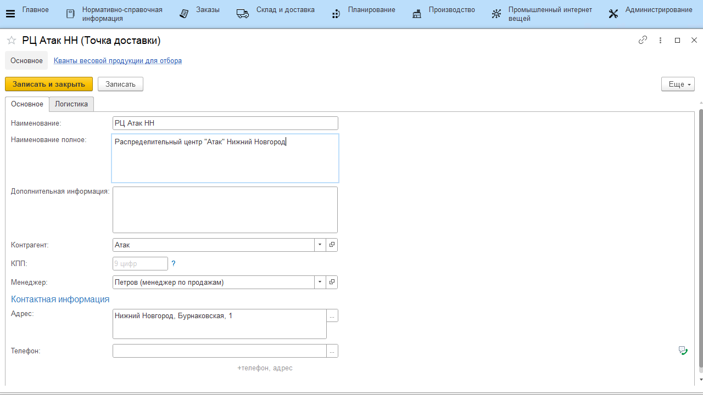
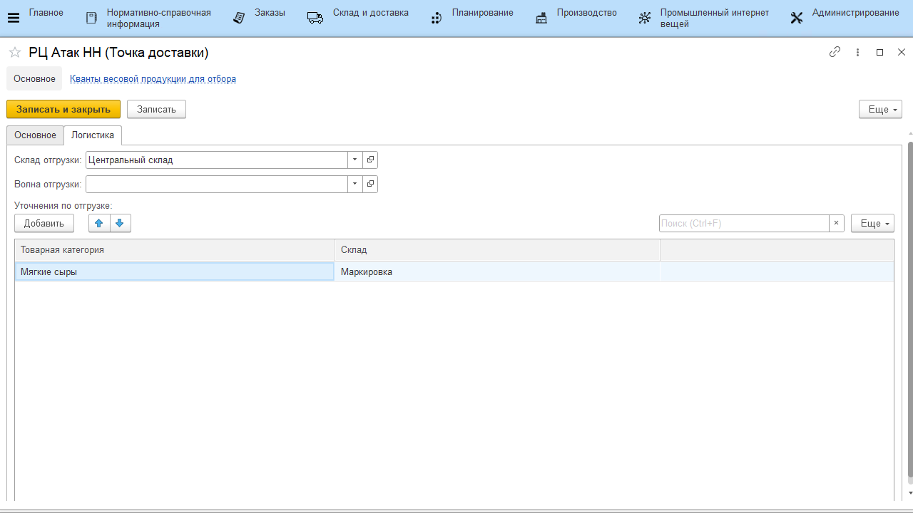

# Точки доставки

В справочнике **"Точки доставки"** указываются торговые точки клиента, до которых будет осуществляться доставка.

**Вкладка "Основное"**

- Наименование
- Дополнительная информация
- [Контрагент](Contractor.md)
- КПП
- Менеджер
- Контактная информация (адрес и телефон)

**Вкладка "Логистика"**

- [Склад отгрузки](Warehouse.md)
- Волна отгрузки
- Уточнения по отгрузке (можно уточнять склад отгрузки для товарной категории)