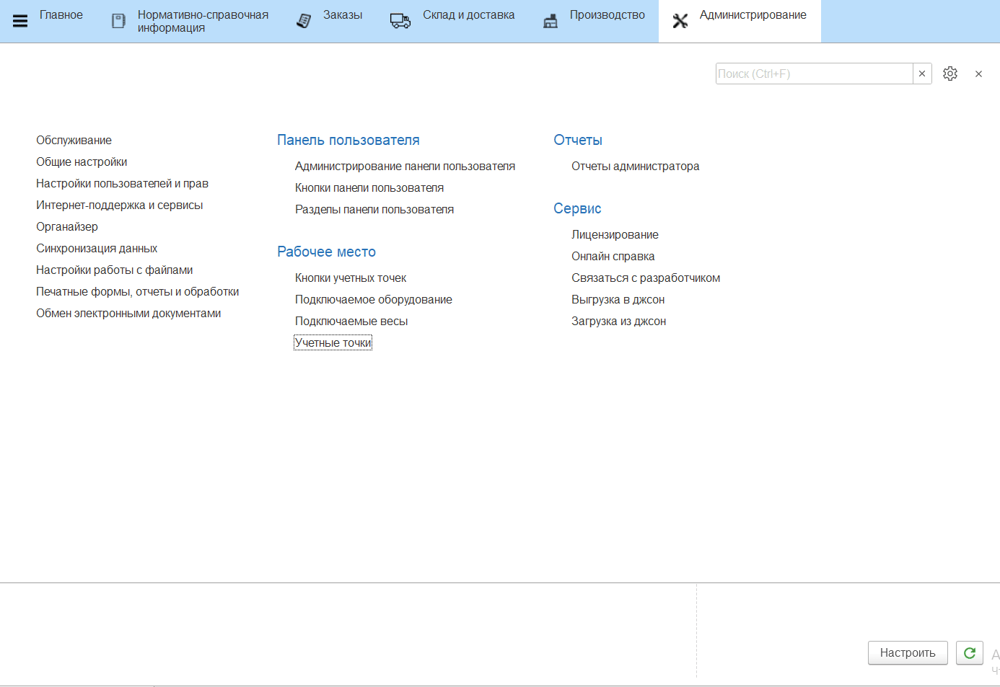

# Кнопки учетных точек

Данный справочник используется для настройки различных операции, выполняемых на определенном участке склада.

Для создания кнопок необходимо:

- Открыть справочник **"Учетные точки"**. Среди списка найти нужную и открыть;
- В таблице **Кнопки** нажать **"Создать"**;
- Указать **Наименование**;
- Выбрать обработку;
- Выбрать необходимую операцию и заполнить настройки;

Подробнее про каждую обработку описано в разделе [Общая информация - Настройки кнопок учетных точек](../CommonInformation/ButtonOfAccountPoint/readme.md).
