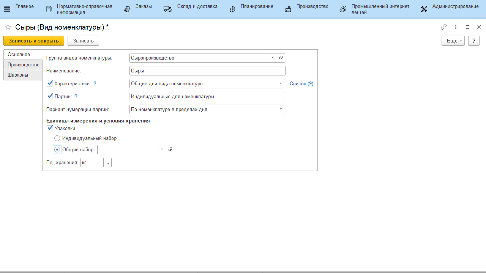
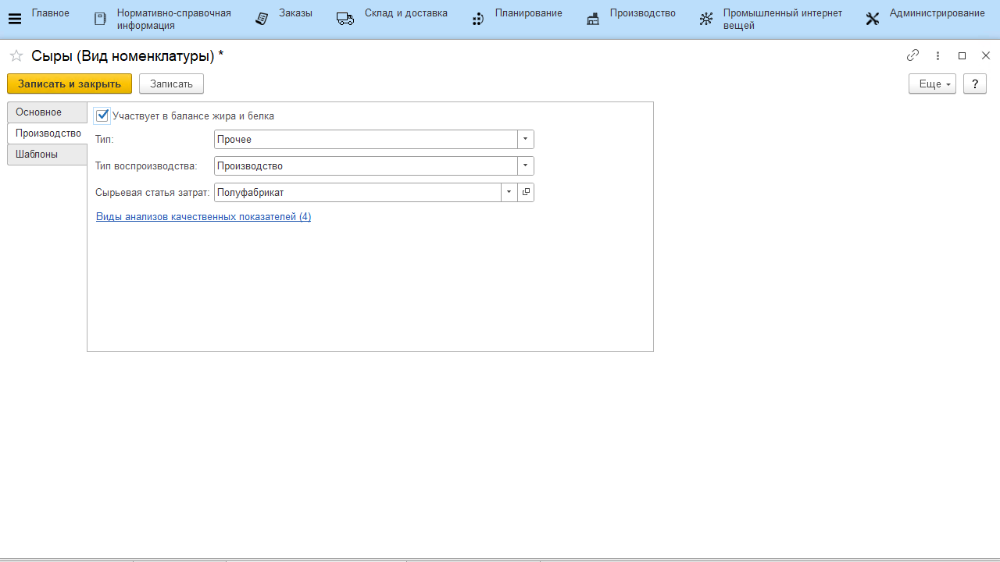
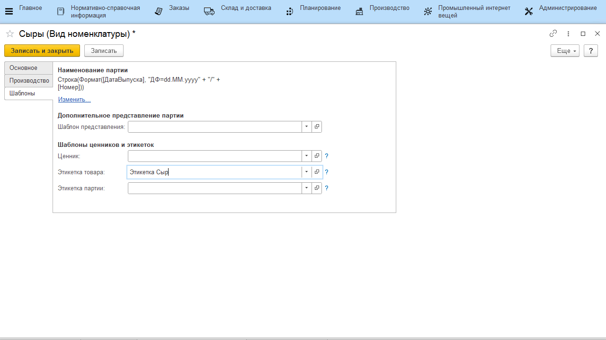

# Виды номенклатуры

Справочник **"Виды номенклатуры"** предназначен для группировки продаваемых товаров по ассортименту. Виды номенклатуры объединяют номенклатуру по общим признакам учета, таким как учет по характеристикам и партиям.

**Вкладка "Основное"**

- *Характеристики* - включение/отключение учета по характеристикам (когда партия одной и той же продукции переходит по разным этапам, меняя характеристику);

- *Список (0)* - доступен после записи элемента. Определяет список характеристик, общий для данного вида номенклатуры;
- *Партии* - включение/отключение учета по партиям;
- *Вариант нумерации партий* - определяет, как будет заполняться "Номер" в партии продукции (при создании партий в "Производственном задании", если в [виде рабочего центра]() стоит параметр, завязанный на этот):
    -   По виду номенклатуры в течение года - даже для разных номенклатур,
    но с одним этим общим видом, будет вестись сквозная нумерация партий
    (1, 2, 3, ..) до конца года;
    -   По номенклатуре в пределах дня - нумерация для номенклатур этого
    вида идет независимо друг от друга;
- *Упаковки* - включает/отключает использование указания, по сколько
    каких единиц "укладывается" номенклатура в различные упаковки:
    - Индивидуальный набор - задается уже в номенклатуре;
    - Общий набор - общий для всех номенклатур данного вида
- *Единица хранения* - основная единица учета номенклатур данного вида (может быть изменена в номенклатуре).

**Вкладка "Производство"**

- *Участвует в балансе жира и белка* - включает/отключает "участие" продукции данного вида в балансе жира и белка. Если да, то в системе нужно будет учитывать эти показатели для продукции данного вида;
- *Тип* - пакет, прочее, сырье и материалы;
- *Тип воспроизводства* - производство, покупка;
- *Сырьевая статья затрат*;
- Гиперссылка на *Виды анализов качественных показателей* - доступна, если включен учет по партиям - определяет набор видов анализов, выполняемых по данному виду номенклатуры;

**Вкладка "Шаблоны"**

Видна, если включен учет по партиям.

