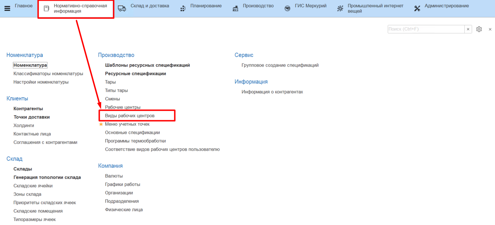
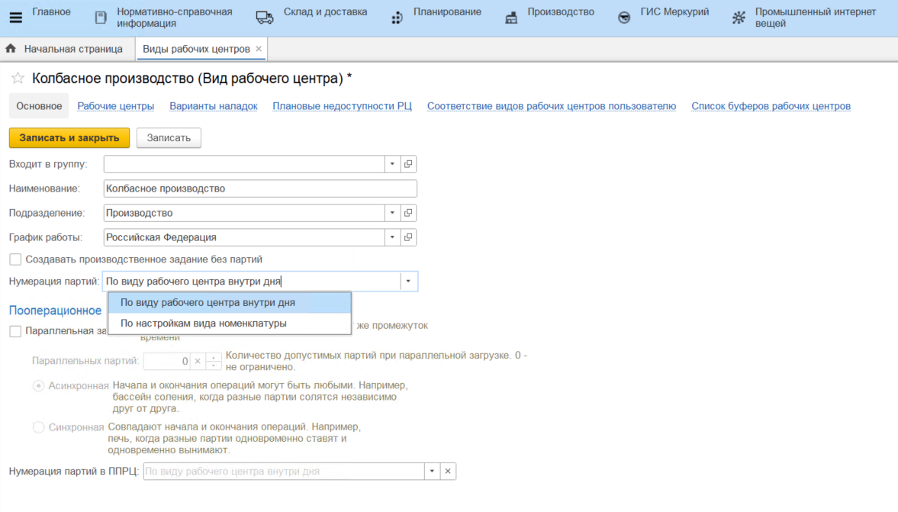
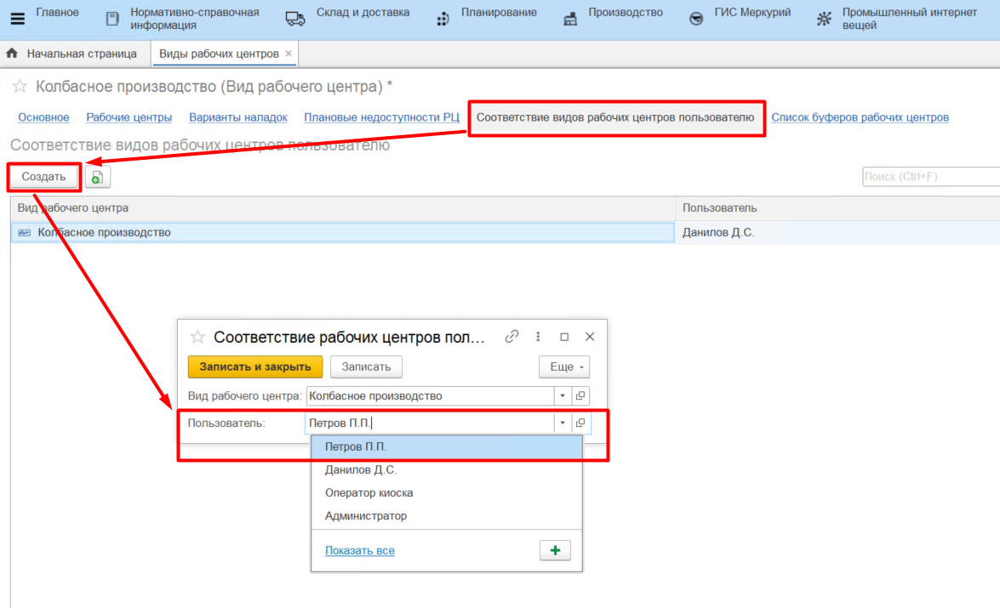

# Виды рабочих центров

Справочник **"Виды рабочих центров"** предназначен для объединения рабочих центров в виды. Рабочие центры, которые обладают схожими параметрами и характеристиками, можно объединить в вид и задать для вида общие настройки. Справочник расположен в подсистеме **"Нормативно-справочная информация"**.

### Вкладка "Основное"

- Наименование;
- Подразделение - указывается Подразделение организации к которому относится данный ВРЦ;
- График работы;
- Создавать производственное задание без партий - если включено, для всех рабочих центров, которые относятся к данному ВРЦ, производственные задания будут создаваться без партий, партия будет создана в момент выпуска по заданию;
- Вариант нумерации партий:
    - по виду рабочего центра внутри дня - если включено, то для всех рабочих центров, которые относятся к данному ВРЦ, нумерация партий будет сквозной в пределах дня (например, на РЦ Сепарация выпущенная партия будет иметь номер 1, следующая за ней партия, которая была выпущена на РЦ Нормализация, будет иметь номер 2).
    - по настройкам вида номенклатуры - если включено, вариант настройки нумерации партий берется из справочника **"Виды номенклатуры"**.
- Настройки пооперационного планирования (подробнее см. в разделе [Пооперационное планирование - Настройка видов рабочих центров и рабочих центров](../PooperationalPlanning/Handbooks/SettingWorkCenter.md)).

### Соответствие видов рабочих центров пользователю

Таблица на вкладке содержит информацию о правах доступа пользователей из АРМа "Рабочее место мастера смены". В регистре **"Соответствие видов рабочих центров пользователю"** задается правило, по которому отбираются доступные для мастера смены виды рабочих центров.

Например, мастеру смены в колбасном цехе ставится в соответствие вид рабочего центра "Колбасное производство", таким образом в АРМе "Рабочее место мастера смены" мастер увидит информацию только по своему участку (подробнее см. в разделе [Действия в рабочем месте мастера смены](../Manufacture/Milk/CommonInformation/Functional/WorkPlaceOfShiftWizard/WorkPlaceOfShiftWizard.md/)).

Для того, чтобы создать соответствие, необходимо:

- перейти к созданию нового элемента;
- выбрать пользователя, которому нужно дать доступ к выбранному виду рабочего центра.
- нажать **"Записать и закрыть"**.

