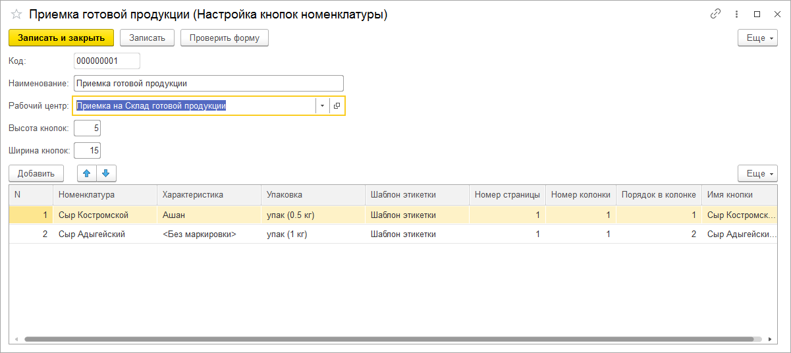

# Настройка кнопок Номенклатуры

Справочник **"Настройка кнопок номенклатуры"** позволяет настроить **"Форму выбора номенклатуры"** для конкретных рабочих центров для быстрого выбора поступившей на склад продукции.

При создании элемента справочника указываются параметры:

- Код - заполняется автоматически
- Наименование
- Рабочий центр
- Высота кнопок
- Ширина кнопок

Заполняется таблица номенклатурных позиций:

- Номенклатура
- Характеристика
- Упаковка
- Шаблон этикетки
- Номер страницы
- Номер колонки
- Порядок в колонке
- Имя кнопки - сформируется автоматически при заполнении полей, можно редактировать

После записи настройки по кнопке **"Проверить форму"** можно посмотреть как будут выглядеть кнопки на форме:

