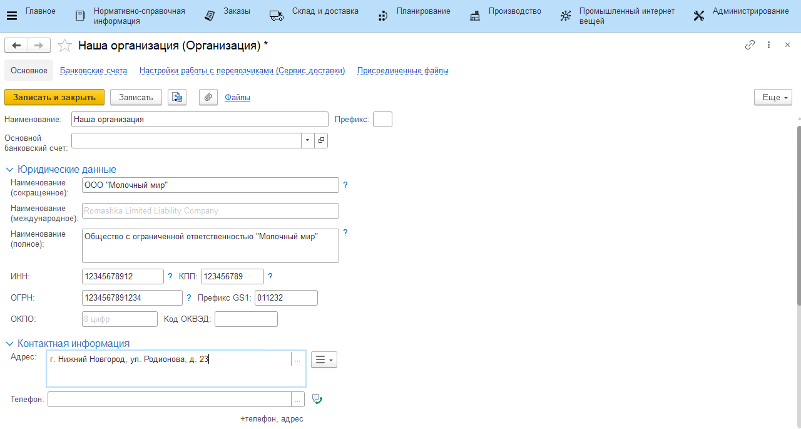

# Организации

Справочник **"Организации"** определяет по какому количеству организаций ведется учет в системе.

**Вкладка "Основное"**

- Наименование
- Префикс
- Основной банковский счет

**Вкладка "Юридические данные"**

- Наименования: сокращенное, международное, полное
- ИНН
- КПП
- ОГРН
- Префикс GS1
- ОКПО
- Код ОКВЭД

**Вкладка "Контактная информация"**

- Адрес
- Телефон
- Электронная почта
- Фактический адрес
- Юридический адрес

**Вкладка "Ответственные лица"**

- Директор
- Главный бухгалтер
- Все лица с правом подписи
- Печать организации