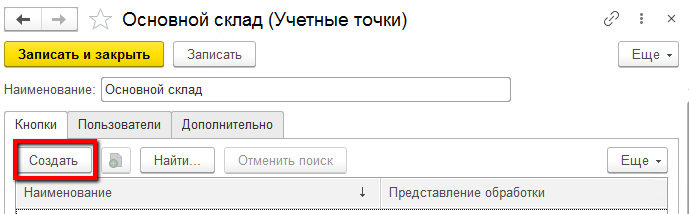
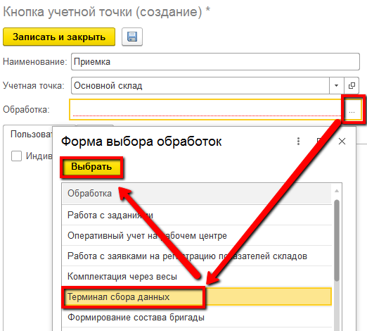

# Кнопки учетных точек

Данный справочник используется для настройки различных операции, выполняемых на определенном участке склада. Например, для работы кладовщика нам необходимы кнопки Приемки и Отгрузки.

Для создания кнопок необходимо:

- Открыть справочник "Учетные точки". Среди списка найти нужную и открыть.

- В таблице **Кнопки** нажать **"Создать"**:

- Указать **Наименование**
- Выбрать обработку **"Терминал сбора данных"**

- Выбрать необходимую **"Операцию"** и заполнить необходимые настройки

<ins>Дальнейшее описание настроек по операциям:</ins>

- Приемка
- Перемещение
- Отгрузка
- Паллетирование
