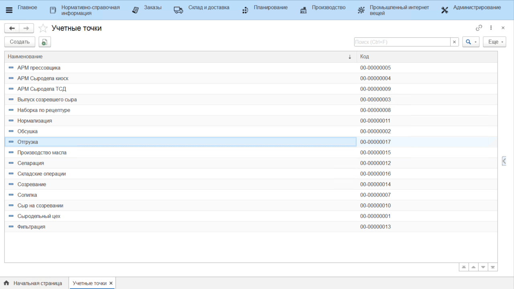

# Кнопки учетных точек

Данный справочник используется для настройки различных операции, выполняемых на определенном участке склада. Например, для работы кладовщика необходимо настроить кнопки Приемки и Отгрузки.

Для создания кнопок необходимо:

- Открыть справочник **"Учетные точки"**. Среди списка найти нужную и открыть;
- В таблице **Кнопки** нажать **"Создать"**;
- Указать **Наименование**;
- Выбрать обработку **"Терминал сбора данных"**;
- Выбрать необходимую операцию и заполнить настройки;

<ins>Дальнейшее описание настроек по операциям:</ins>

- [Приемка](../../Warehouse/SimpleWarehouse/Priemka/PriemkaCYpakList/NastroikaKnopkiPriemka.md)
- [Перемещение](../../Warehouse/SimpleWarehouse/Peremeshenie/NastroikaKnopkiPeremeshenie.md) 
- [Отгрузка](../../Warehouse/SimpleWarehouse/Otgruzka/OtgruzkaTCD/NastroikaKnopkiOtgruzka.md)
- [Паллетирование](../../Warehouse/SimpleWarehouse/Paletirovanie.md)
