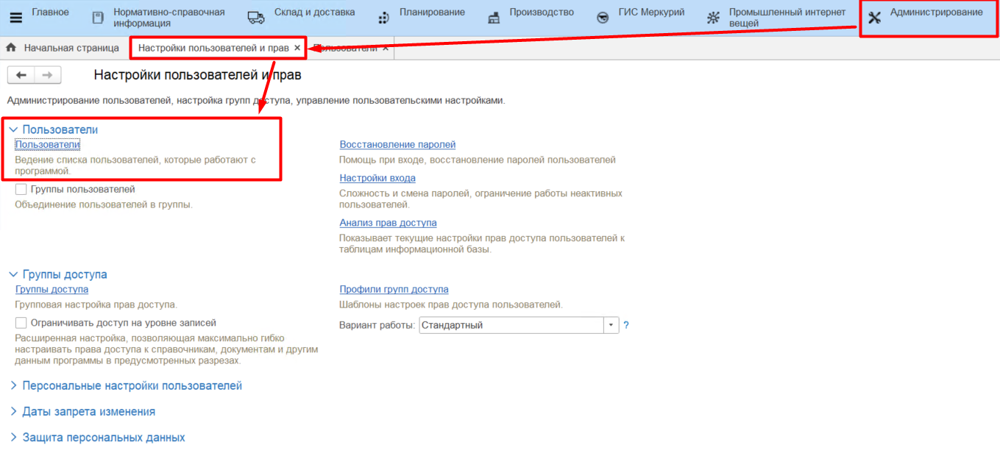
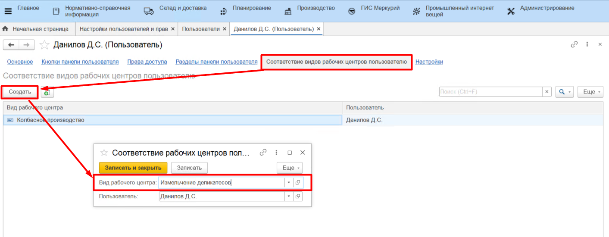

# Пользователи

Справочник **"Пользователи"** предназначен для управления учетными записями пользователей системы. Справочник расположен в подсистеме **"Администрирование" -> "Настройки пользователей и прав"**.

В карточке пользователя представлено несколько вкладок:

- Вкладка "Основное" - настройки профиля пользователя и аутентификации;
- Кнопки панели пользователя - настройка индивидуальных кнопок быстрого доступа;
- Права доступа - группы доступа, к которым относится пользователь, и их профили;
- Разделы панели пользователя - настройка индивидуальных разделов на панели пользователя;
- Соответствие видов рабочих центров пользователю - список ВРЦ, доступных пользователю в АРМе "Рабочее место мастера смены"

### Соответствие видов рабочих центров пользователю

Таблица на вкладке содержит информацию о правах доступа пользователей из АРМа "Рабочее место мастера смены". В регистре **"Соответствие видов рабочих центров пользователю"** задается правило, по которому отбираются доступные для мастера смены виды рабочих центров.

Например, мастеру смены в колбасном цехе ставится в соответствие вид рабочего центра "Колбасное производство", таким образом в АРМе "Рабочее место мастера смены" мастер увидит информацию только по своему участку (подробнее см. в разделе [Действия в рабочем месте мастера смены](../Manufacture/Milk/CommonInformation/Functional/WorkPlaceOfShiftWizard/WorkPlaceOfShiftWizard.md/)).

Для того, чтобы создать соответствие, необходимо:

- перейти к созданию нового элемента;
- выбрать вид рабочего центра, к которому нужно дать доступ выбранному пользователю.
- нажать **"Записать и закрыть"**.

