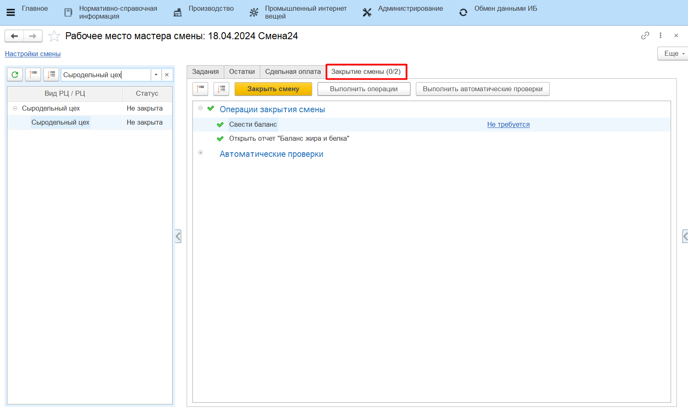
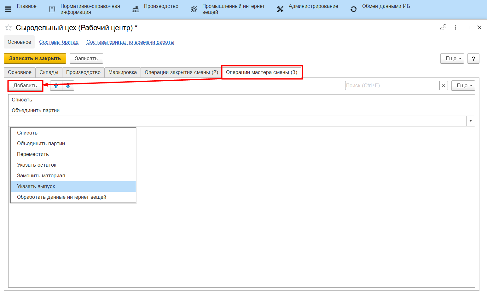
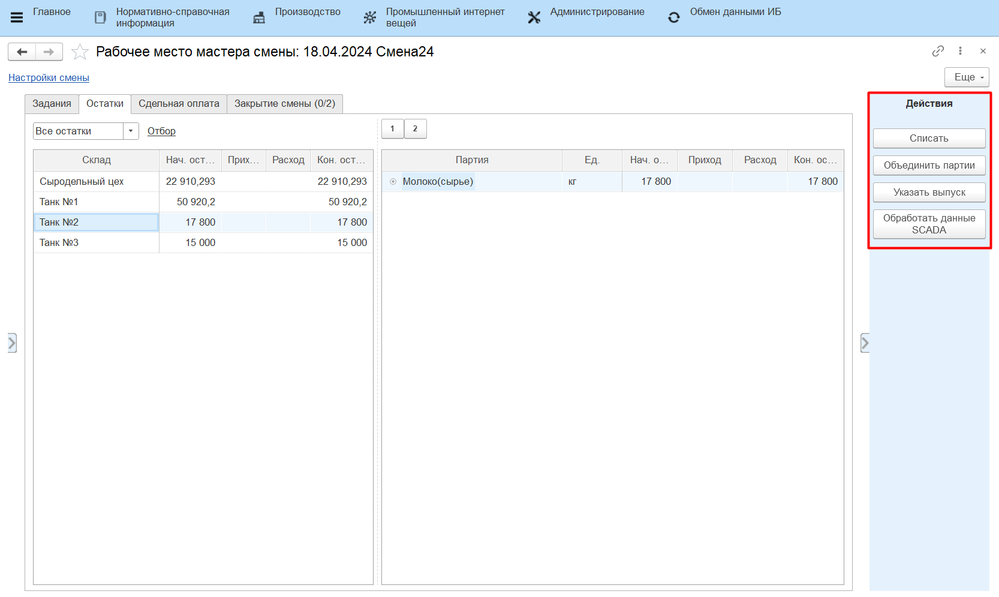

# Рабочие центры

Справочник **"Рабочие центры"** предназначен для ведения списка доступного оборудования. Справочник расположен в подсистеме **"Нормативно-справочная информация"**.

### Вкладка "Основное"

- Наименование;
- Вид рабочего центра;
- Группа в которую входит рабочий центр - позволяет объединить рабочие центры в группы (например, сгруппировать по складу);
- Подразделение - указывается Подразделение организации к которому относится данный РЦ;
- График работы.

### Вкладка "Склады"

- Использование одного склада или нескольких;
- Склад основных материалов;
- Склад вспомогательных материалов.

### Вкладка "Маркировка"

- Склад сырья;
- Ячейка сырья - поле доступно, если на складе сырья используется адресное хранение;
- Склад выпуска;
- Ячейка выпуска - поле доступно, если на складе выпуска используется адресное хранение;
- Использовать идентификатор линии для оборудования.

### Вкладка "Операции закрытия смены"

Содержит список операций, которые для выбранного рабочего центра автоматически будут выполнены при закрытии смены в АРМе **"Рабочее место мастера смены"**.

Доступные операции:

- Списать усушку - при закрытии смены со склада(-ов) рабочего центра спишутся остатки основных материалов, которые в течение дня тратились на выпуски;
- Перераспределить сырье - при закрытии смены будет произведено перераспределение сырья между основными и побочными выпусками продукции;
- Открыть отчет **"Анализ варки"**;
- Открыть отчет **"Анализ выходов"**;
- Свести баланс - при закрытии смены будет сведен баланс по жиру и белку (используется на переделах, где берутся анализы жира и белка сырья и продукции);
- Открыть отчет **"Баланс жира и белка"**.

В АРМе **"Рабочее место мастера смены"** перечень выбранных операций отображается на вкладке "Закрытие смены".

### Вкладка "Операции мастера смены"

Содержит список операций, которые для выбранного рабочего центра доступны для выполнения в [АРМе "Рабочее место мастера смены"](../Manufacture/Cheese/CommonInformation/Functional/WorkPlaceOfShiftWizard/WorkPlaceOfShiftWizard.md). Если для рабочего центра не настроен ограниченный список операций, в АРМе будут отображаться все операции. 

Доступные операции:

- Списать;
- Объединить партии;
- Переместить;
- Указать остаток;
- Заменить материал;
- Указать выпуск;
- Обработать данные SCADA.

В АРМе **"Рабочее место мастера смены"** перечень выбранных операций отображается на панели действий (справа).

