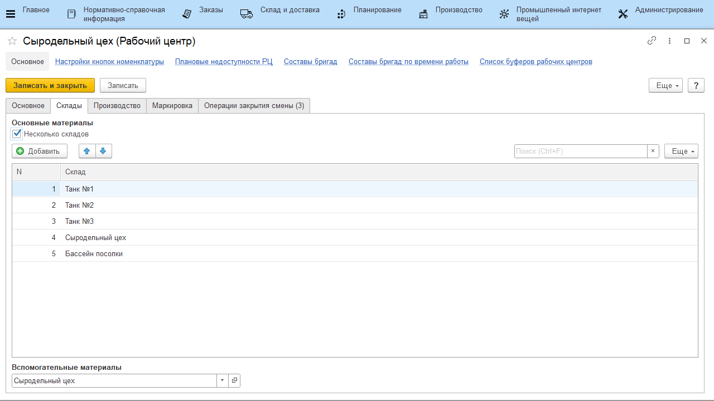
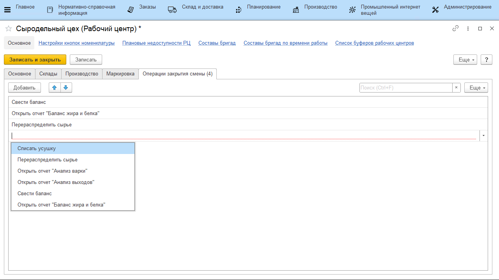

# Рабочие центры

Справочник **"Рабочие центры"** предназначен для ведения списка доступного оборудования. Справочник рабочие центры расположен в подсистеме **"Нормативно-справочная информация"**.

**Вкладка "Основное"**

- Наименование
- Вид рабочего центра
- Группа в которую входит рабочий центр - позволяет объединить рабочие центры в группы (например, сгруппировать по складу)
- Подразделение - указывается Подразделение организации к которому относится данный РЦ
- График работы

**Вкладка "Склады"**

- Использование одного склада или нескольких
- Склад основных материалов
- Склад вспомогательных материалов

**Вкладка "Маркировка"**

- Склад сырья
- Ячейка сырья - поле доступно, если на складе сырья используется адресное хранение
- Склад выпуска
- Ячейка выпуска - поле доступно, если на складе выпуска используется адресное хранение
- Использовать идентификатор линии для оборудования

**Вкладка "Операции закрытия смены"**

Доступные операции:

- Списать усушку - при закрытии смены со склада(-ов) рабочего центра спишутся остатки основных материалов, которые в течение дня тратились на выпуски.
- Перераспределить сырье - при закрытии смены будет произведено перераспределение сырья между основными и побочными выпусками продукции;
- Открыть отчет **"Анализ варки"**;
- Открыть отчет **"Анализ выходов"**;
- Свести баланс - при закрытии смены будет сведен баланс по жиру и белку (используется на переделах, где берутся анализы жира и белка сырья и продукции);
- Открыть отчет **"Баланс жира и белка"**.