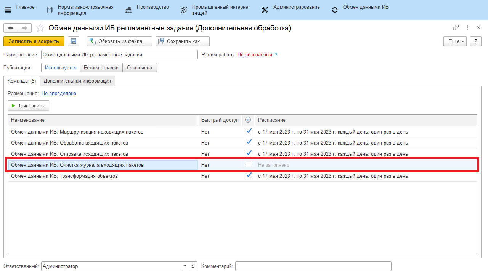
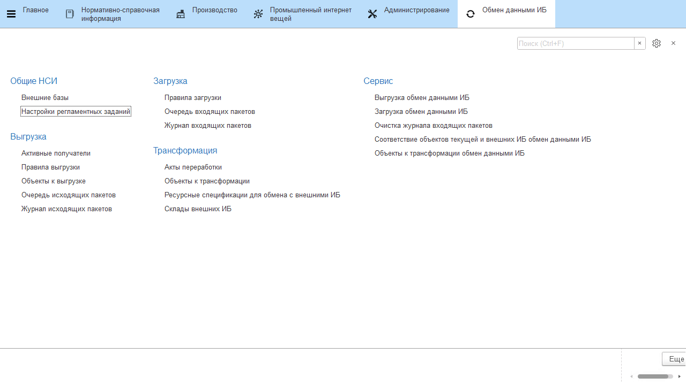
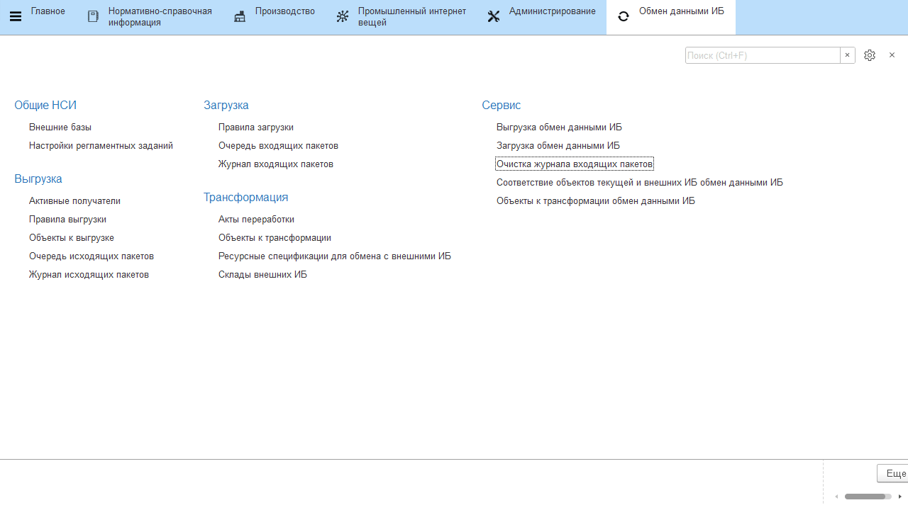

# Очистка "Журнала входящих пакетов"

**Журнал входящих пакетов** - это регистр, в котором хранится информация о полученных и обработанных пакетах, а также об ошибках получения. 

Из-за постоянного получения данных регистр становится объемным. Чтобы не хранить информацию, которая больше не нужна используется обработка **"Очистка журнала входящих пакетов"**.

Запускать обработку можно вручную или по расписанию, как регламентное задание.

Настройки очистки по умолчанию задаются в регистре **"Настройки регламентных заданий"**.

При создании нужно указать:

- **Тип обработки** - "Очистка журнала входящих пакетов";
- **Срок хранения записей** - записи за какой период нужно оставить при очистке;
- **Количество удаляемых записей** - сколько записей за раз удаляется при очистке.

Для запуска обработки вручную нужно перейти в раздел **Сервис** - **Очистка журнала входящих пакетов**.

В открывшейся форме можно указать параметры очистки журнала, отличные от настроек по умолчанию. 

- **Повторно удалять записи с ошибками**:
    - если опция не выбрана, то записи, которые не удалось удалить по какой-либо причине, не будут удалены, а отобразятся в табличной части **"Список ошибок"**; 
    - если выбрана, то записи будут удаляться повторно.

Далее нажать на кнопку **"Выполнить очистку"**, записи из Журнала входящих пакетов будут удалены.

!!! info "Важно"
    Регламентное задание по очистке использует настройки по умолчанию, в таком случае записи с ошибками удаления **не будут** удаляться повторно.