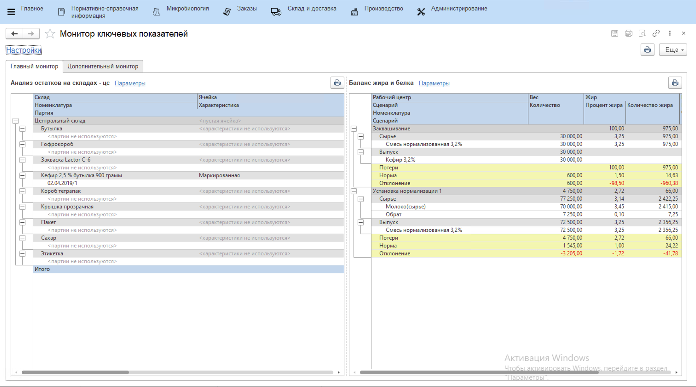

# Монитор ключевых показателей

Рабочее место Монитор ключевых показателей предназначен для руководителей, начальников, заведующих и т.п., кому необходимо оперативно получать, анализировать и сравнивать информацию по метрикам и показателям, которые содержатся в разных отчетах. В данном рабочем месте есть возможность настроить дашборд с отчетами для разных ситуаций и комбинаций, собрать всю необходимую информацию в одном месте, а также персонализировать дашборд для каждого пользователя.

