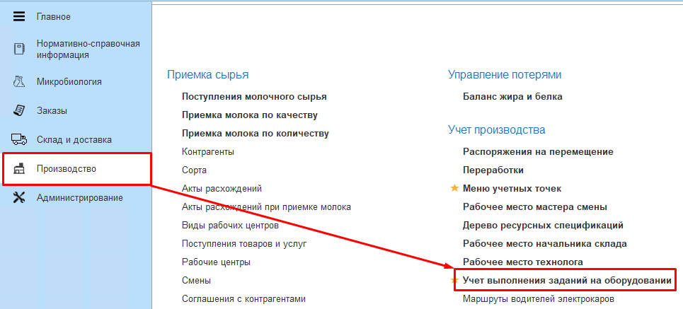
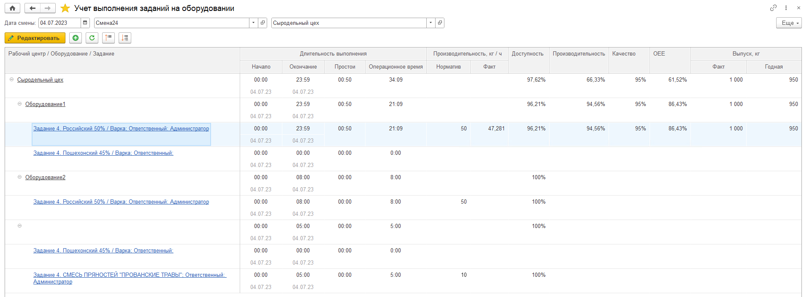
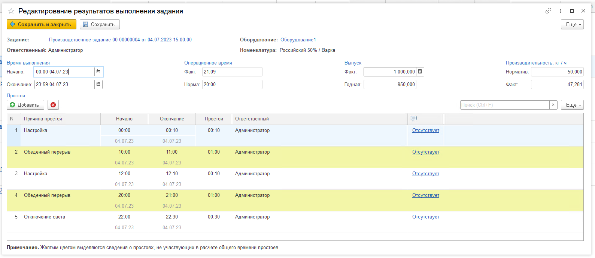

# АРМ Учет выполнения заданий на оборудовании

Для отслеживания показателей общей эффективности оборудования в системе предусмотрен АРМ **Учет выполнения заданий на оборудовании**.  
АРМ расположен в подсистеме Производство - Учет производства - Учет выполнения заданий на оборудовании.

   

В АРМе заполняются: 

- Дата смены;  
- Смена;  
- [Вид рабочего центра](../../../CommonInformation/KindOfWorkCenter.md).

   

В АРМе отображаются:  

- Длительность выполнения  
  - Начало, указывается на форме отражения работы оборудования.  
  - Окончание, указывается на форме отражения работы оборудования.  
  - Простои, сумма учитываемых простоев внутри задания.  
  - Операционное время, которое рассчитывается по формуле:  
    ```
    Операционное время = Время работы оборудования - Неучитываемые простои - Учитываемые простои 
    ```
- Производительность  (кг/ч)
    - Норматив заполняется из [ресурсной спецификации](../../../Manufacture/Cheese/CommonInformation/Handbooks/ResourceSpecifications/ResourceSpecifications.md).  
    - Факт рассчитывается по формуле производительности: 
    ```
    Производительность = Выпуск Годная / Операционное время Факт
    ```
- Доступность рассчитывается по формуле.  
    ```
    Доступность = Операционное время / (Время работы оборудования - Неучитываемые простои)
    ```
- Производительность, которая рассчитывается по формуле:
    ```
    Производительность = Выпуск факт / (Операционное время Факт * Производительность Норматив)
    ```
- Качество рассчитывается по формуле:
    ```
    Качество = Выпуск Годная / Выпуск Факт
    ```
- OEE рассчитывается по формуле:  
    ```
    OEE = Доступность * Производительность * Качество
    ```
- Выпуск, кг  
    - Факт, указывается на форме отражения работы оборудования, переведенный в кг. 
    - Годная, заполняется по выпуску за период сессии, переведенный в кг.  

При нажатии на гиперссылку на строке задания или по кнопке Редактировать открывается форма данных по работе на оборудовании.

  

На форме редактирования результатов выполнения задания указываются:  

- Дата и время начала и окончания работы на оборудовании;    
- Фактический выпуск;  
- Причины простоя оборудования.  

В таблице простоев указываются:  

- Дата и время начала и окончания простоя;  
- [Причина простоя](CausesOfEquipmentDowntime.md);   
- Ответственный;  
- Комментарий.  