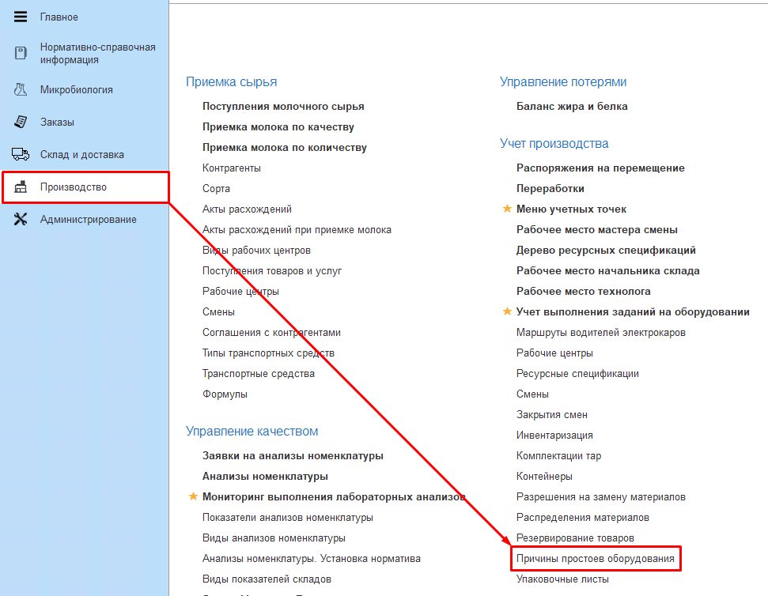
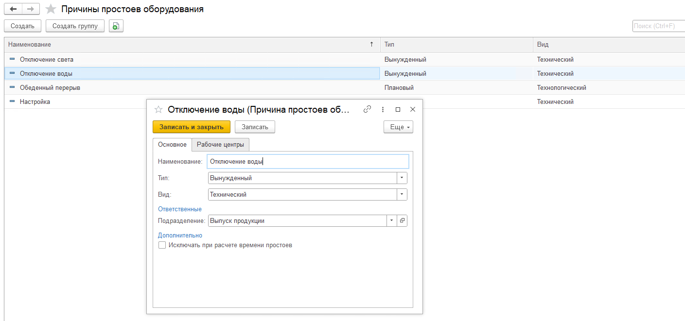

# Причины простоев оборудования

Справочник **Причины простоев оборудования** необходим для расчета общей эффективности работы оборудования и анализа причин простоев.  
Справочник находится в подсистеме Производство - Учет производства - Причины простоев оборудования.  

 

На вкладке Основное указываются:
- Наименование;
- Тип Плановый, Вынужденный;
- Вид Технический, Технологический;
- Подразделение, ответственное за простой;
- Признак Исключать при расчете времени простоев. Простой с этим признаком не будет считаться потерей на остановки.  

На вкладке Рабочие центры при снятии признака Общая причина простоя можно указать конкретные рабочие центры, для которых будет доступен выбор данного простоя.

 