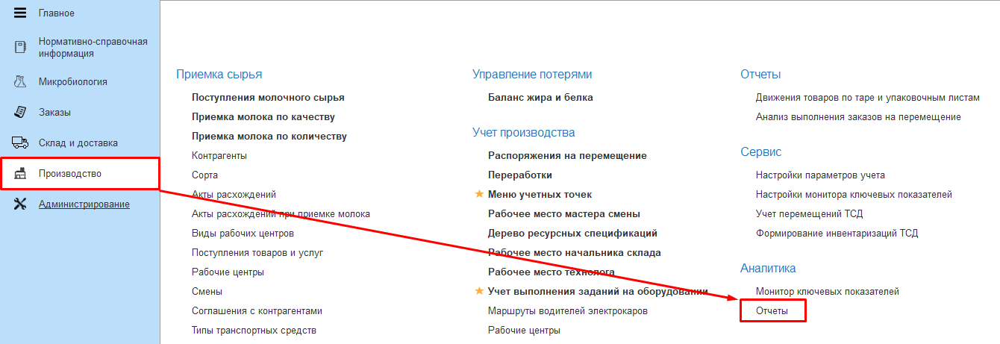
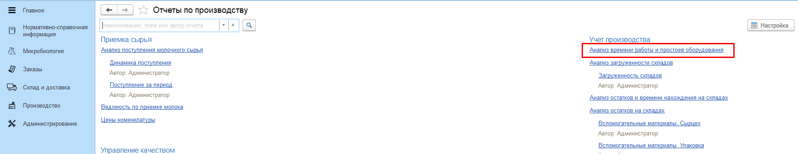
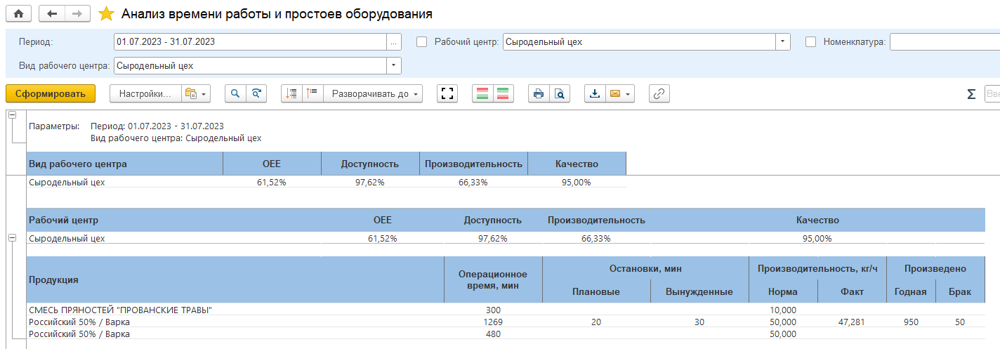

# Анализ времени работы и простоев оборудования

Отчет **Анализ времени работы и простоев оборудования** показывает результаты выполнения заданий на оборудовании по система анализа общей эффективности работы оборудования.  
Отчет находится в подсистеме Производство - Аналитика - Отчеты.

   

   

В отчете обязательно указываются: 
- Период отчета;
- Вид рабочего центра.

   

В отчете выводятся результаты выполнения заданий по виду рабочего центра и рабочему центру по следующим формулам: 
- *Доступность = Операционное время / (Время работы оборудования - Неучитываемые простои)*  
- *Производительность = Выпуск факт / (Операционное время Факт * Производительность Норматив)*  
- *Качество = Выпуск Годная / Выпуск Факт*  
- *OEE = Доступность * Производительность * Качество*  

По выпущенной продукции выводятся:
- Операционное время выпуска в минутах;
- Плановые и вынужденные остановки в минутах;
- Производительность кг/ч;
- Годный и бракованный выпуск в кг.