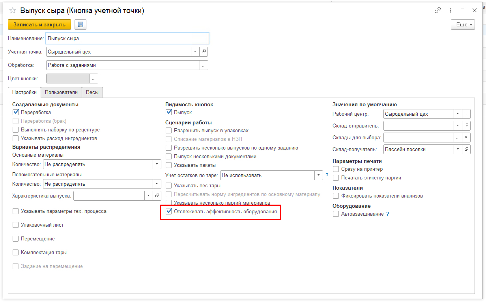
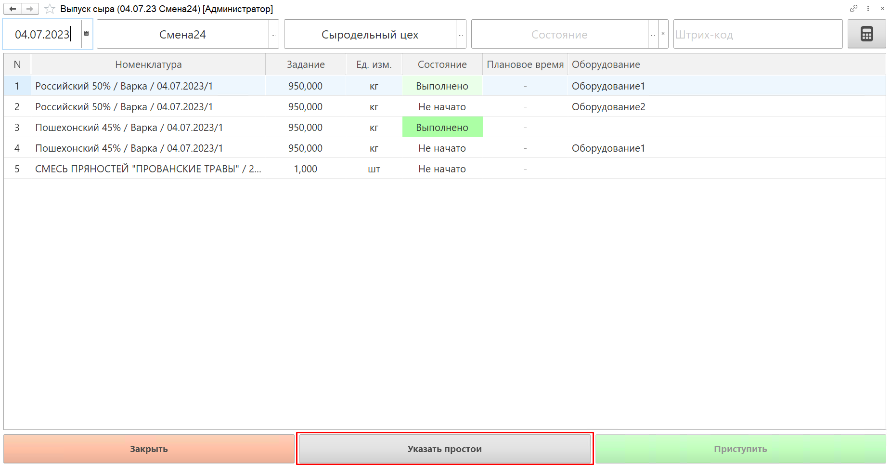
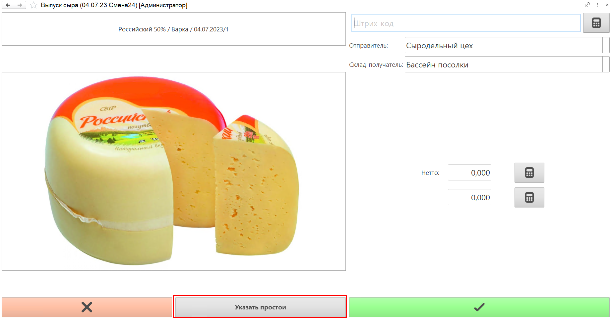
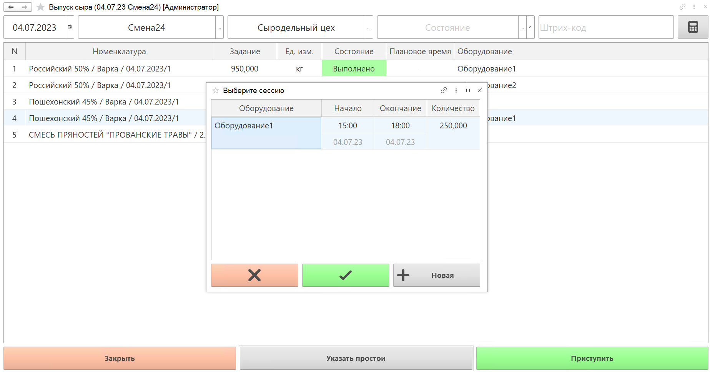
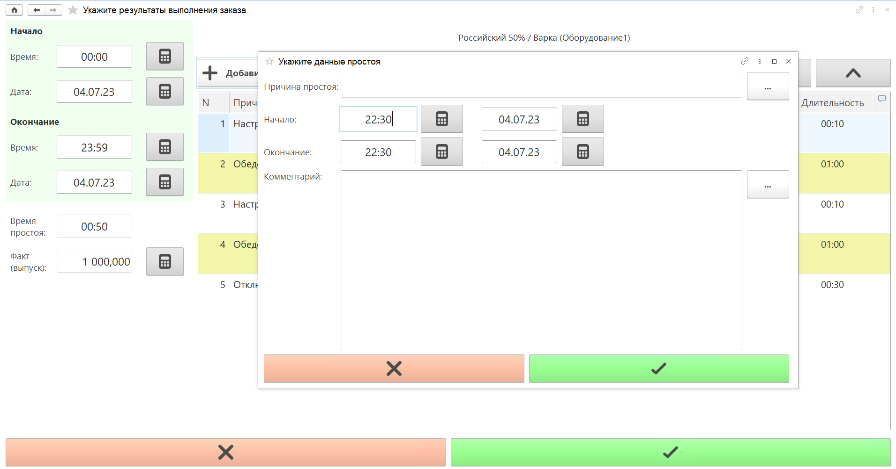

# Указание результатов работы на оборудовании через обработку Работа с заданиями

Чтобы иметь возможность указывать данные по работе на оборудовании из Меню учетных точек, необходимо в настройках [КУТ](../../../CommonInformation/ButtonOfAccountPoint/WorkWithTasks.md) для обработки Работа с заданиями включить сценарий Отслеживать эффективность оборудования.

 

После включения настройки, в списке заданий Меню учетных точек по данной КУТ и на форме выпуска появится кнопка Указать простои.

 

 

Если текущий пользователь уже задавал время работы оборудования, то откроется список сессий на этом оборудовании. Можно изменить текущую или создать новую.  

!!! info "Важно"
    Сессии внутри одного производственного задания не могут пересекаться по дате и времени.

 

На форме указания данных выполнения задания указываются:

- Дата и время начала и окончания работы на оборудовании;  
- Фактический выпуск;
- Причины простоя оборудования.

На форме указания данных по простоям указываются:

- Дата и время начала и окончания простоя;
- [Причина простоя](CausesOfEquipmentDowntime.md); 
- Комментарий.

Время простоя рассчитывается автоматически.

 