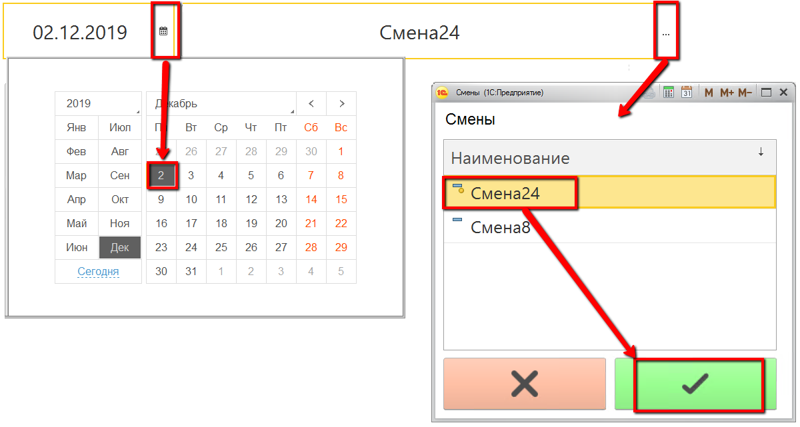
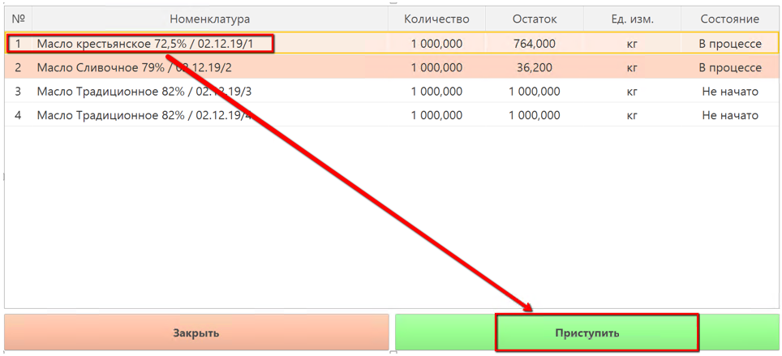
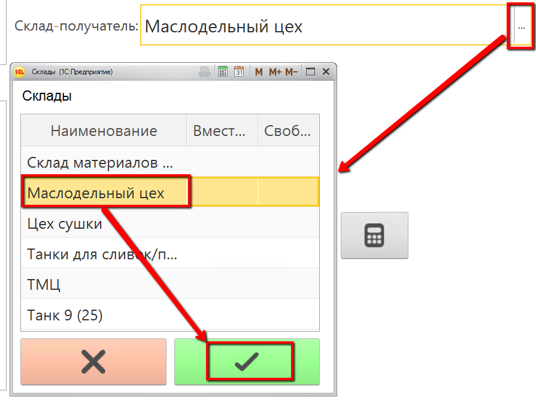
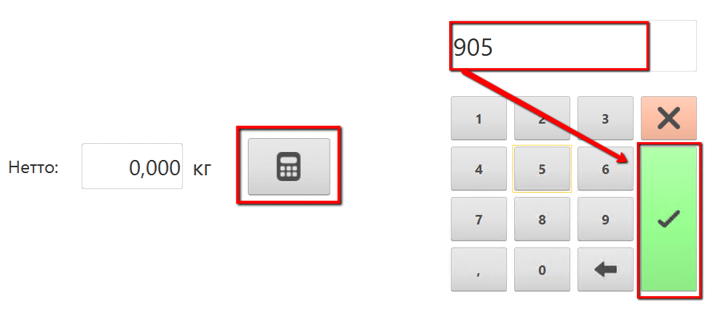

# Учет выпуска масла с фасовкой

-   Открыть "Меню учетных точек":  
    
     
-   Указать текущую дату и смену, если они еще не указаны:  
    
    
-   Указать учетную точку, отвечающую за участок, где происходит
    сбойка масла/спреда:  
    

-   Нажать на кнопку, соответствующую операции выпуска сбойки.  
    Откроется окно с заданием на указанную смену. Выбрать первую сбойку и нажать "Приступить":  
    

-   Указать, куда передается сбойка:  
    
     

-   Указать вес сбойки:  
    

-   Подтвердить выпуск.
 
