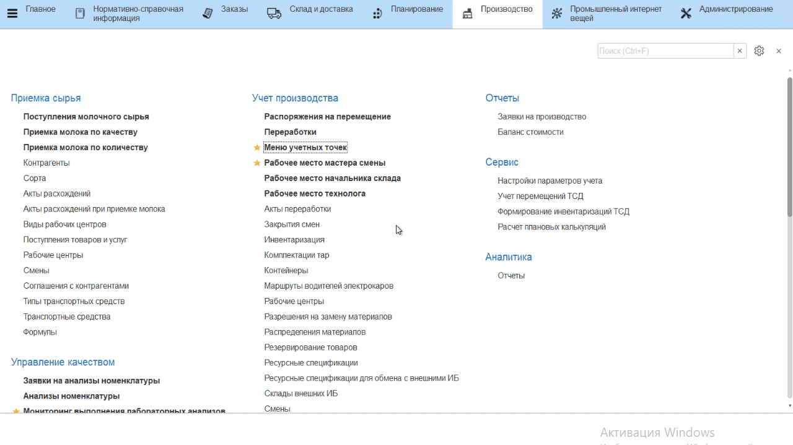

# Учет выпуска масла с фасовкой

-   Открыть **"Меню учетных точек"**;  
-   Указать текущую дату и смену, если они еще не указаны;
-   Указать учетную точку, отвечающую за участок, где происходит
    сбойка масла/спреда;
-   Нажать на кнопку, соответствующую операции выпуска сбойки.  
    Откроется окно с заданием на указанную смену. Выбрать первую сбойку и нажать **"Приступить"**;
-   Указать, куда передается сбойка (склад-получатель);
-   Указать, в какую упаковку фасуется сбойка;
-   Указать вес получившейся сбойки;
-   Подтвердить выпуск.

