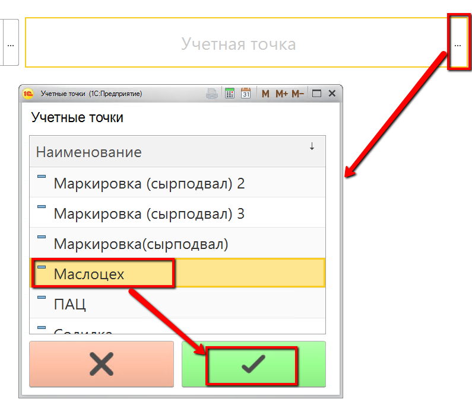
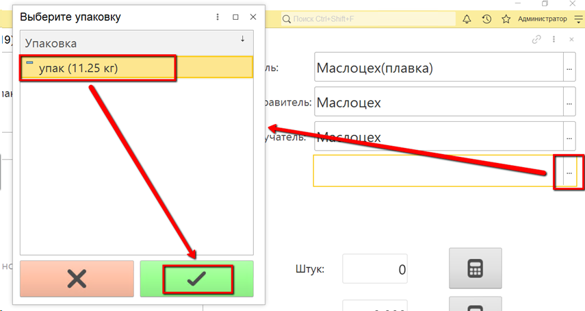
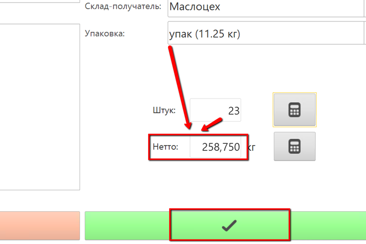

# Учет нарезки монолита 

Учет нарезки монолита происходит через учетную точку, привязанную к
участку нарезки маслоцеха.

 

 

-   Открыть "Меню учетных точек":  
    
     
-   Указать дату смены и смену:  
    
     
-   Указать учетную точку, отвечающую за участок, где указывается факт
    нарезки маслоцеха:  
    
     
-   Нажать на кнопку, соответствующую учету выпуска нарезки монолита.  
    Указать склад, с которого забирается партия монолита масла на
    нарезку:  
    
     
-   Отобразятся остатки всех партий на выбранном складе. Выбрать нужную
    партию и нажать "Выбрать":  
    
     
-   Указать, какими упаковками выпускается нарезанный монолит:  
    
     
-   Указать количество упаковок, автоматически рассчитается вес:  
    
     
-   Подтвердить.

 
