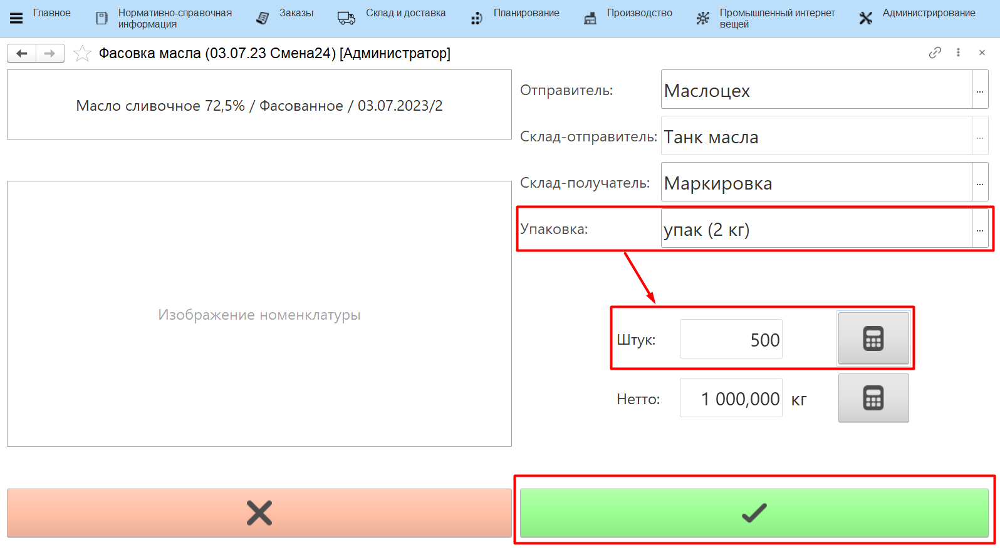

# Учет нарезки монолита 

Учет нарезки монолита происходит через учетную точку, привязанную к
участку нарезки маслоцеха.

-   Открыть **"Меню учетных точек"**;
-   Указать дату смены и смену;
-   Выбрать учетную точку, отвечающую за участок маслоцеха;
-   Нажать на кнопку, соответствующую учету выпуска нарезки монолита.  
-   Указать склад, с которого забирается партия монолита масла на
    нарезку;
-   Отобразятся остатки всех партий на выбранном складе. Выбрать нужную
    партию и нажать **"Выбрать"**;
-   Указать, какими упаковками выпускается нарезанный монолит;
-   Указать количество упаковок, автоматически рассчитается вес;
-   Подтвердить.

