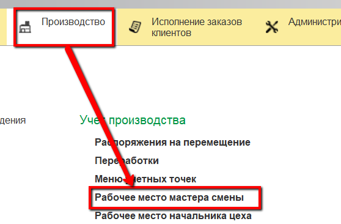
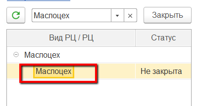
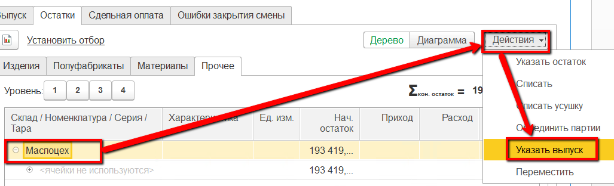
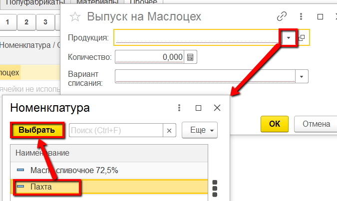
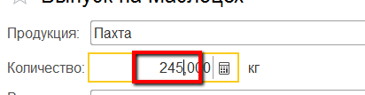
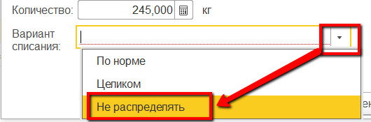

# Выпуск пахты

Выпуск пахты за всю смену мастер смены может учесть через свое рабочее
место.

 

 

-   Открыть "Рабочее место мастера смены":  
    
     
-   Указать дату смены, смену и участок приемно-аппаратного цеха:  
      
    
     
-   Выбрать участок маслоцеха:  
    
     
-   Перейти на вкладку "Остатки" -\> "Прочее":  
    
     
-   Выбрать склад, на котором выпускается пахта и нажать "Указать
    выпуск":  
    
     
-   Указать, что это учет выпуска пахты:  
    
     
-   Указать выпущенный за смену объем:  
    
     
-   Указать, что при учете выпуска материалы не списываются (они будут
    распределены потом, в соответствие с внесенными в систему
    показателями жира и белка выпусков и сырья):  
    
     
-   Подтвердить.

