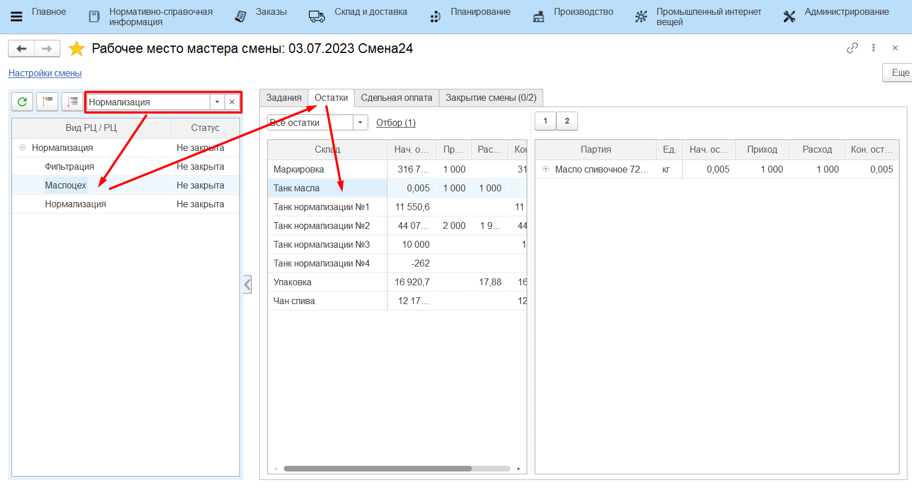
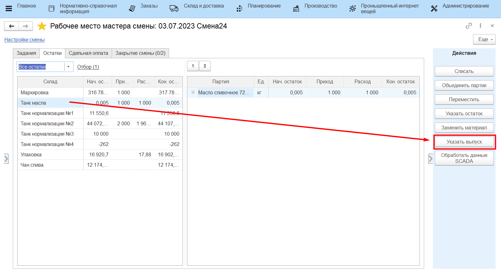
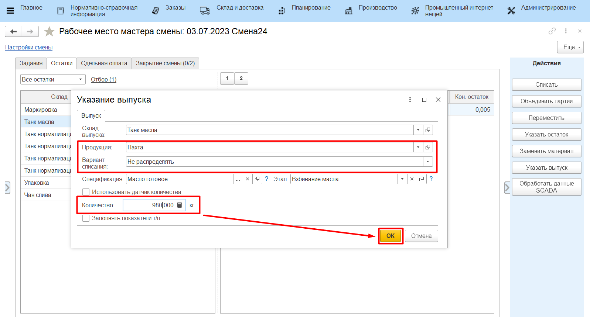

# Выпуск пахты

Выпуск пахты за всю смену мастер смены может учесть через свое рабочее
место.

-   Открыть **"Рабочее место мастера смены"**;
-   Указать дату смены, смену и вид рабочего центра;  
-   Выбрать участок маслоцеха;
-   Перейти на вкладку *"Остатки"*;

-   Выбрать склад, на котором выпускается пахта и нажать **"Указать выпуск"**:

-   Указать выпуск пахты;
-   Указать, что при учете выпуска материалы не списываются (они будут
    распределены потом, в соответствие с внесенными в систему
    показателями жира и белка выпусков и сырья);
-   Указать выпущенный за смену объем;
-   Подтвердить.

     
