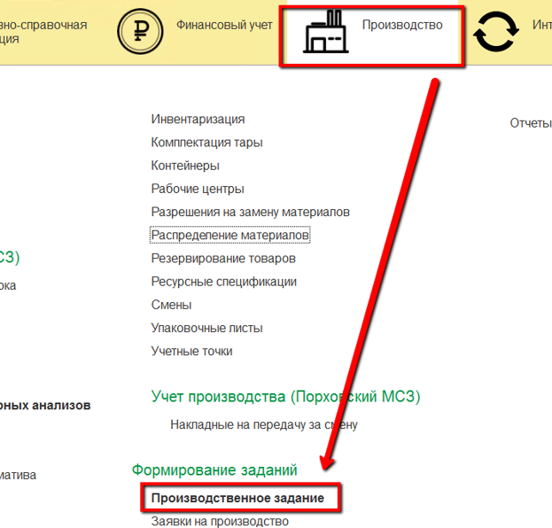
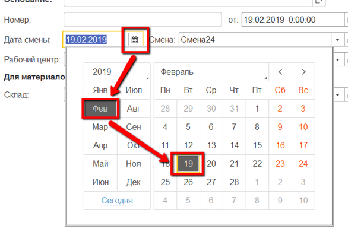
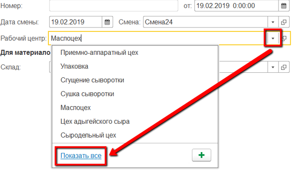
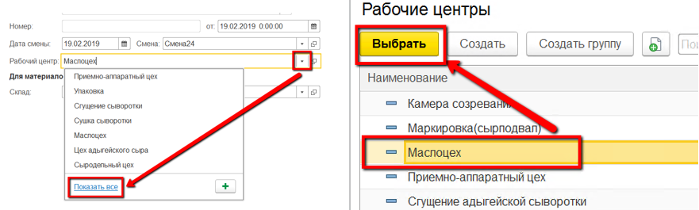
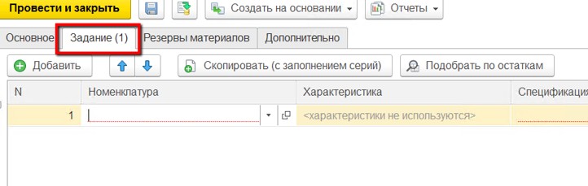
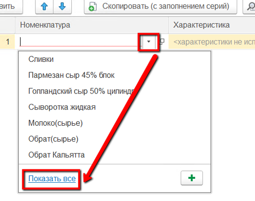
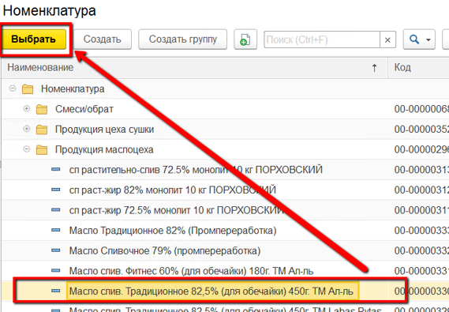
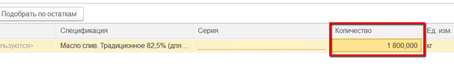

# Задание на сбойку масла/спреда

В начале каждой смены мастер выдает работникам маслоцеха задание на
сбойку спреда/масла. В системе это отражается документом
"Производственное задание".

 

 

-   Открыть документы "Производственные задания" и перейти к созданию
    нового:  
    
     
-   Указать смену и участок, на котором происходит сбойка масла/спреда:  
      
      
    
     
-   Перейти на вкладку «Задание». Здесь нужно указать все сбойки
    спреда/масла, которые планируется сделать за указанную смену. При
    этом важно соблюдать порядок - указывать сбойки в производственном
    порядке:  
    
     
-   Добавить первую сбойку:  
         
    
     
-   Указать количество, планируемое для этой сбойки:  
    
     
-    Повторить п.4-5 для всех последующих сбоек и нажать "Провести и закрыть"
