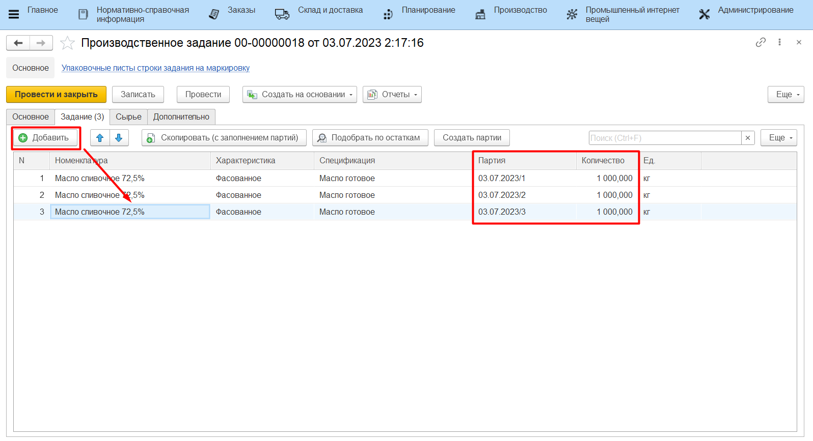

# Задание на сбойку масла/спреда

В начале каждой смены мастер выдает работникам маслоцеха задание на
сбойку спреда/масла. В системе это отражается документом
**"Производственное задание"**.

-   Открыть **"Рабочее место мастера смены"**;
-   Указать дату смены;
-   Выбрать вид участка и участок маслоцеха;
-   На вкладке *"Задания"* нажать **"Создать задание"**;

-   Перейти на вкладку "Задание". Здесь нужно указать все сбойки
    спреда/масла, которые планируется сделать за указанную смену. При
    этом важно соблюдать порядок - указывать сбойки в производственном
    порядке;
-   Указать количество, планируемое для этой сбойки;
-   Нажать **"Провести и закрыть"**.

