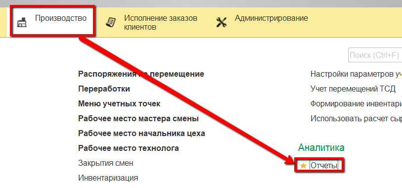
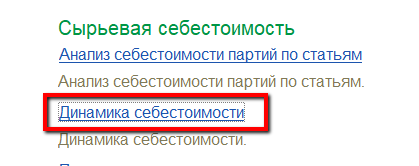
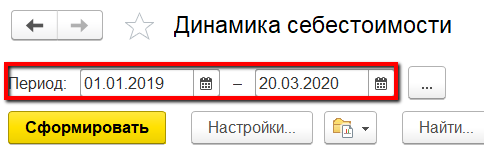
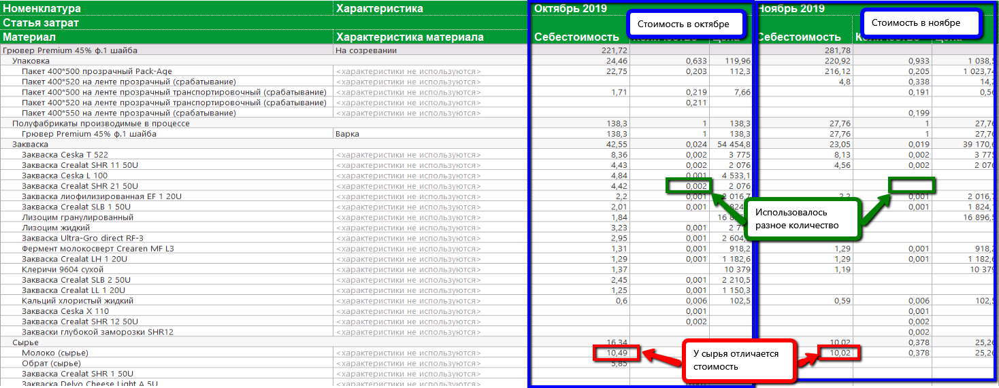

# Анализ динамики себестоимости

Со временем в системе накапливается информация по себестоимости
продукции в разные периоды времени. Проанализировать, в какой месяц было
дороже, в какой дешевле и почему, можно в отчете "Динамика
себестоимости".

 

 

-   Открыть отчет:  
  

-   Указать период и сформировать:  

-   В отчете будет представлена информация по фактической себестоимости
    продукции на каждом этапе, из чего она сложилась в рамках каждого
    месяца, попавшего в период:  
  
С помощью данного отчета можно проследить, почему, например,
    себестоимость в текущем месяце отличается от предыдущего. Например,
    использовались разные материалы или может быть в разном количестве.

