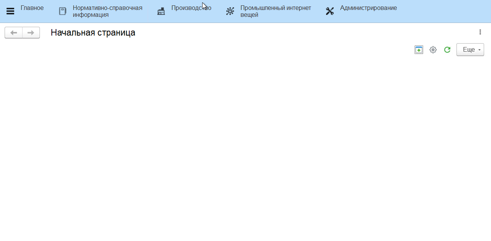
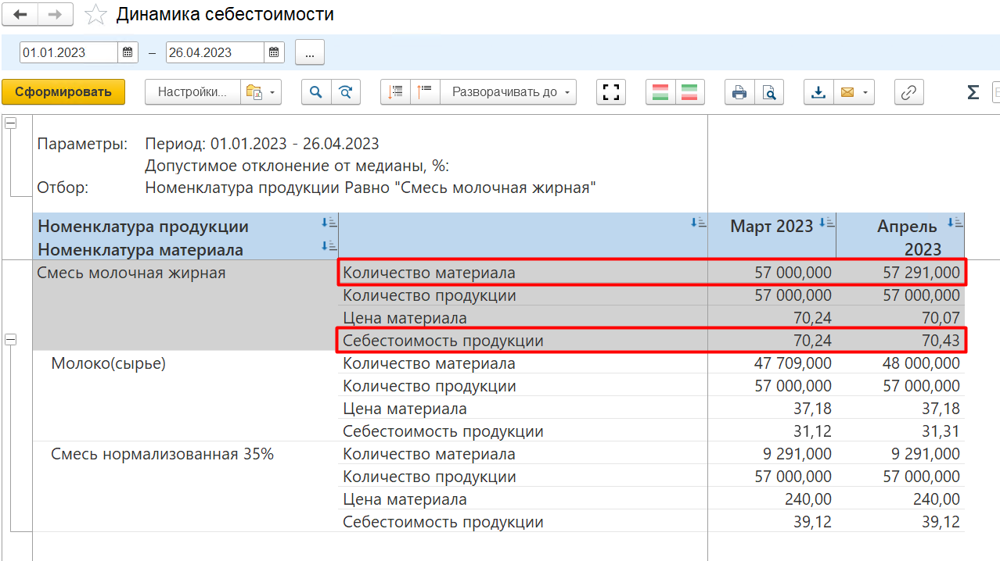
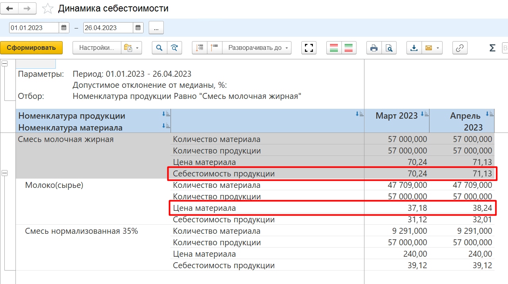

# Анализ динамики себестоимости

Со временем в системе накапливается информация по себестоимости продукции в разные периоды времени. Проанализировать, в какой месяц было дороже, в какой дешевле и почему, можно в отчете **"Динамика себестоимости"**.

Для этого нужно:

- открыть отчет;  
- указать период и нажать **"Сформировать"**.

В отчете представлена информация по фактической себестоимости продукции на каждом этапе производства, из чего она сложилась в рамках каждого месяца, попавшего в период. С помощью данного отчета можно проследить, почему себестоимость менялась со временем. Например, с наступлением нового месяца изменилась цена на сырье, увеличились расходы материалов или изменились масштабы выпуска.

