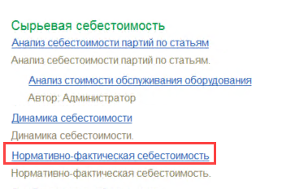
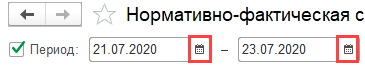
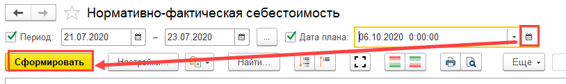
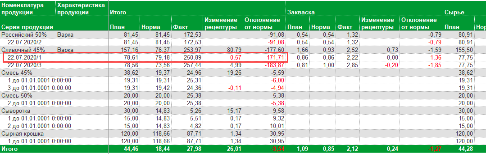
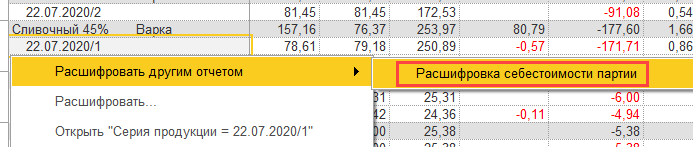
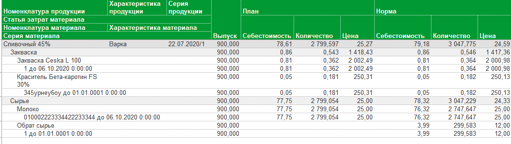

# Анализ себестоимости партий

Получившуюся фактическую себестоимость партий, а также из чего она
сложилась можно посмотреть в отчете "Нормативно-фактическая себестоимость".

 

- Открыть отчет:      
    
  

- Указать период:  
  

- Указать, на какую дату взять плановую себестоимость для сравнения и сформировать:

  

-   По продукции отобразится следующая информация:
    - Какая плановая себестоимость для нее  по когда-то заданной основной рецептуре и стоимости материалов на тот момент - как общая, так и в разрезе статей затрат (столбец "План");
    
    - Какова должна была быть нормативная стоимость конкретной партии продукции, т.е. если бы все материалы взяли столько, сколько нужно, по той рецептуре, по которой её выпустили, по цене материалов на момент выпуска (столбец "Норма");
    
    - Сколько по факту получилась стоимость (столбец "Факт");
    
    -   Какая разница получилась между стоимостью по плановой рецептуре и по фактической (столбец "Изменение рецептуры");
    
    -   Какая разница получилась между нормативной и фактической себестоимостью (столбец "Отклонение от нормы"):
    
    
    
- Можно посмотреть, из чего у конкретной партии сложилась такая
  себестоимость. Для этого выбрать нужную партию и нажать на неё дважды. В
  контекстном меню выбрать "Расшифровать другим отчетом" -\> "Расшифровка
  себестоимости партии":  
  

-   Сформируется новый отчет, в котором будет подробнее описано, из чего
сложилась себестоимость выбранной продукции:  

