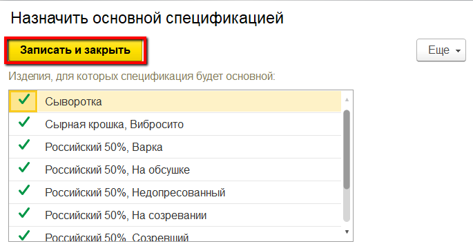
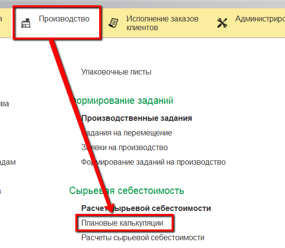
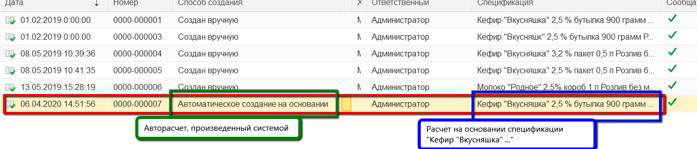

# Расчет плановой себестоимости

Для того, чтобы в системе произошел расчет плановой себестоимости какой-либо продукции, необходимо:
- установить для всех производимых выпусков и молочного сырья нормативное содержание жира и белка
- завести на эту продукцию рецептуру (справочник "Ресурсные спецификации") и назначить ее основной.

!!! info "Не забыть про плановую стоимость материалов и сырья"
    Для такого расчета нужно, чтобы в системе были установлены цены на материалы и плановые себестоимости второстепенных выпусков (см.[Установка цен на вспомогательные материалы](../SettingCostOfMaterials/SettingCostOfMaterials.md)).

-   После назначения рецептуры основной:  
    

-   На основании установленных цен и заведенной рецептуры создается документ **Плановая себестоимость**, в которой рассчитывается плановая себестоимость продукта на всех этапах, указанных в рецептуре:  
      
    
