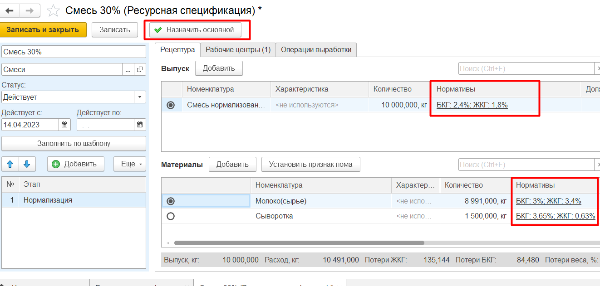
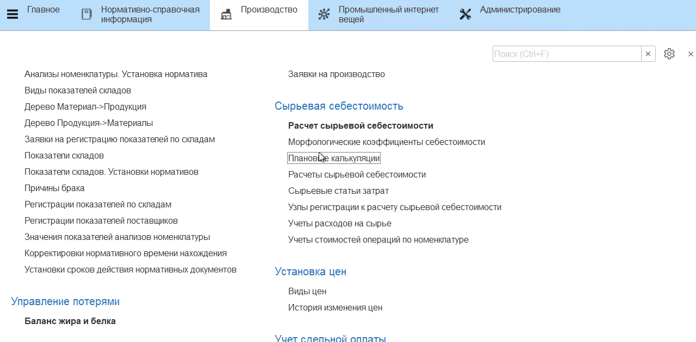

# Расчет плановой себестоимости

Плановая себестоимость продукта - это себестоимость нормативного выпуска, рассчитанная на основании плановой себестоимости материала. 

Если на материалы, например, молоко, задана плановая цена поступления (себестоимость) и существует ресурсная спецификация на выпуск продукции из молока в утвержденных объемах, то можно рассчитать себестоимость такого нормативного выпуска. 

Для этого необходимо:

- завести для всех производимых выпусков ресурсную спецификацию (справочник **"Ресурсные спецификации"**) и назначить ее основными;
- установить для всех производимых выпусков и молочного сырья нормативное содержание жира и белка;
- установить цены на материалы и плановые себестоимости возвратных отходов (см.[Установка цен на материалы и сырье](../SettingCostOfMaterials/SettingCostOfMaterials.md)).

После назначения ресурсной спецификации основной документ **"Плановая калькуляция"** создастся автоматически. В документе рассчитывается плановая себестоимость продукта на всех этапах, указанных в спецификации:  

