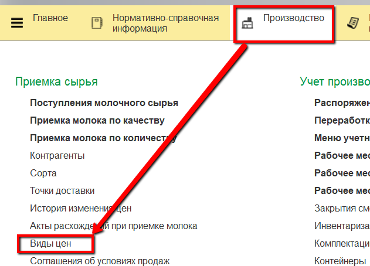
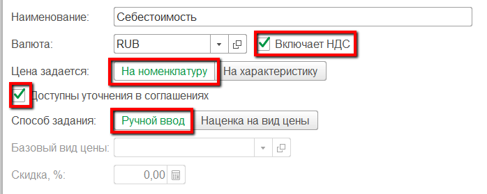
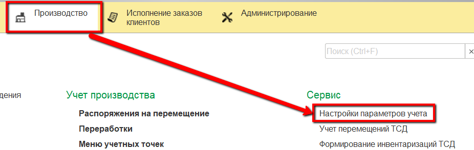
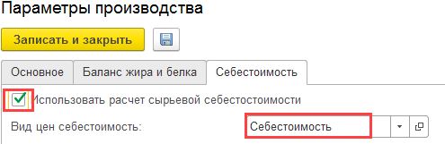
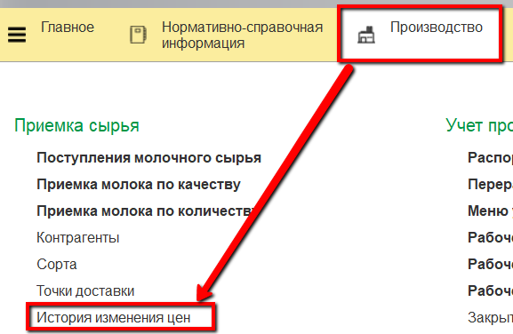
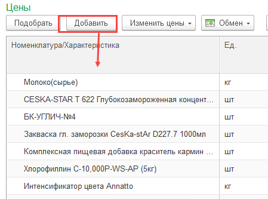
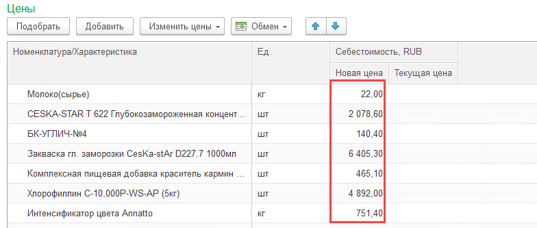

# Установка цен на вспомогательные материалы

Для расчета себестоимости продукции на разных этапах необходимо
фиксировать цены на все вспомогательные материалы, а также плановую
стоимость сырья и вторичных выпусков (сливки, обрат).

 
<h3> Вид цены "Себестоимость" </h3>

В начале нужно задать вид цены, который будет отвечать за себестоимость.

-   Открыть справочник "Виды цен" и перейти к созданию нового элемента:  
    

-   Указать в названии, что цена отвечает за себестоимость:  
    

-   Настроить указанным ниже образом и сохранить:  
    

Теперь нужно указать эту цену в настройках системы.

-   Открыть "Настройки параметров учета":  
    

-   На вкладке "Себестоимость" указать, что будет использован расчет сырьевой себестоимости, и заполнить "Вид цены себестоимость" соответствующим видом цены:  
    

-   Помимо прочего можно указать дополнительные настройки расчетов себестоимости:
    - *Максимальная глубина разузлования* - максимально до какого шага разузловывается сырье, использованное при выпуске конкретной партии
    - *Минимальный коэф.разузлования* - если материал входит в себестоимость партии с коэффициентом, меньшим указанного, он не разузловывается и исключается из рассчета:  
    
    
-   Нажать "Записать и закрыть".
     

<h3> Плановая себестоимость сырья и материалов </h3>

Плановая себестоимость на все закупаемые материалы и сырье в системе фиксируется документами "История изменения цен".

-   Открыть документы "История изменения цен" и перейти к созданию нового:  
    

-   В таблицу добавить вид цены себестоимость, который был указан выше и нажать "Перейти к установке цен":  
    

-   В открывшейся форме в таблицу добавить все материалы, используемые при производстве сыра и сырье:  
    

-   Для каждого вспомогательного материала и сырья заполнить столбец "Новая цена" в соответствие с его предполагаемой плановой стоимостью:  
    

-   Нажать "Провести и закрыть".