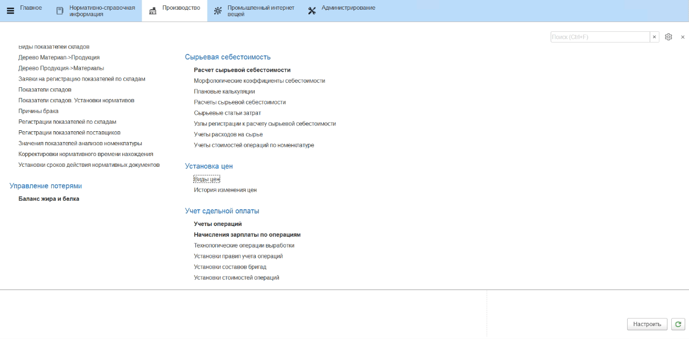
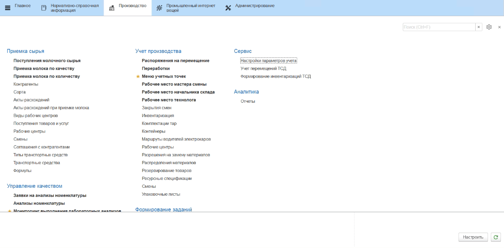

# Установка цен на материалы и сырье

Для расчета себестоимости продукции на разных этапах необходимо
фиксировать цены на все вспомогательные материалы, а также учитывать плановую
стоимость сырья и возвратных отходов (сыворотка, обрат).

!!! info "Примечание"
     Вторичный выпуск считается возвратным отходом, если на него установлена цена. На такой выпуск при производстве не распределяется сырье, при расчете себестоимости сырье на такие выпуски будет "забираться" от основных выпусков. На выпуски вторичных (побочных) полуфабрикатов, для которых нет установки цен, сырье распределяется.

 
## Вид цены "Себестоимость"

В начале нужно задать вид цены, который будет отвечать за себестоимость.

Для этого нужно:

- открыть справочник **"Виды цен"** и перейти к созданию нового элемента;
- указать в наименовании, что цена отвечает за себестоимость;
- настроить вид цены и сохранить:  

После того, как вид цены создан, нужно указать его в качестве цены для расчета в настройках системы.

- Открыть **"Настройки параметров учета"**;  
- На вкладке **"Себестоимость"** указать, что будет использован расчет сырьевой себестоимости (новый), и заполнить **"Вид цены себестоимость"** соответствующим видом цены.
- Также можно указать дополнительные настройки расчетов себестоимости:
    - *Максимальная глубина разузлования* - максимально до какого шага разузловывается сырье, использованное при выпуске конкретной партии;
    - *Минимальный коэф.разузлования* - если материал входит в себестоимость партии с коэффициентом, меньшим указанного, он не разузловывается и исключается из расчета.  
- Нажать **"Записать и закрыть"**.

## Плановая себестоимость сырья, материалов и возвратных отходов

Плановая себестоимость на все закупаемые материалы и сырье в системе фиксируется документами **"История изменения цен"**.

Чтобы установить цены на сырье, нужно:

-   Открыть документы **"История изменения цен"** и перейти к созданию нового элемента;
-   Добавить в таблицу созданный вид цены **"Себестоимость"** и нажать **"Перейти к установке цен"**;
-   В открывшейся форме в таблицу добавить все материалы, используемые при производстве сыра, а также сырье и возвратные отходы (сыворотка, обрат); 
-   Для каждого материала заполнить столбец **"Новая цена"** в соответствие с его предполагаемой плановой стоимостью;
-   Нажать **"Провести и закрыть"**.

<video source src="../SettingCostOfMaterials.assets/1.mp4" width="1024" controls="controls"> </video>