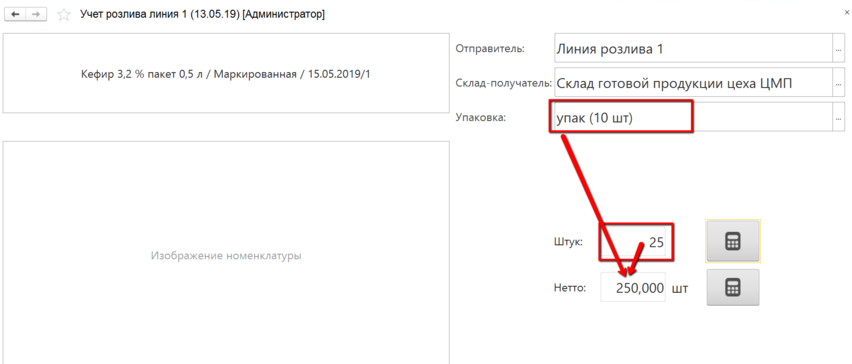

**Работа с заданиями**
======================

Работа с документом "Производственное задание" через киоски и ТСД.
Пример - [работа с заданиями на варку
сыров](../../../../SemiHardCheese/CookingCheese/TaskFormation/TaskFormation.md).

 

**Создаваемые документы.**

 

- **Переработка** или **Переработка (брак)** - допускается выбор
    только одного значения - выпустить по кнопке можно либо бракованную
    продукцию, либо хорошую. Общие параметры для разных сценариев
    документа:

| Блок | Параметр | Описание | Возможные значения |
|----|----|---|---|
| Видимость кнопок | Выпуск | Отображает кнопку для учета выпуска продукции в форме с заданием | |
| Сценарии работы | Разрешить выпуск в упаковках  | Позволяет указывать объем    выпуска в упаковках (с автоматическим пересчетом на штуки) | |
| | Упаковка | Задает, какой единицей измерения будет ограничен выбор упаковок в форме выпуска (см.ниже "Пример 1" - Приемка и передача) | |
| | Разрешить несколько выпусков по одному заданию | Выпуск по одной строке задания можно указывать несколькими "порциями". При этом появляется кнопка завершения строки задания | |
| | Выпуск несколькими документами | Каждая "порция" выпуска фиксируется новым документом "Переработка", даже если это одна строка задания | |
| | Указывать пакеты | Применяется, когда выпускаемая продукция упаковывается еще и в пакеты| |
| | Учет остатков по таре | Ставится, когда продукция выпускается на таре и дальше прослеживается в разрезе этой тары | В разрезе контейнеров - если у тары нет фиксированного номера, а каждый раз присваивается новый   В разрезе тары + указание, какой именно - если у тары есть фиксированный номер |
| | Типы тары | Отображается, когда стоит учет в разрезе тары. Ограничивает список выбора тар в АРМе - будут доступны только с указанными типами | |
| | Указывать вес тары | Завешивание идет на таре, чтобы получить точный вес продукции нужно из общего веса вычитать вес тары| |
| | Использовать калькулятор тары | Можно указать вес тары в виде составных частей с заданным в системе фиксированным весом (см.ниже "Пример 2")||
| | Выпускать на таре материала | Если включен, то выпуск всегда будет идти на таре материала без возможности изменить это ||
| | Типы тары для калькулятора | Отображается, когда включено использование калькулятора тары. Ограничивает список типов тар в калькуляторе | |
| Значения по умолчанию | Рабочий центр | Участок, на который выдается задание| |
| | Склады для выбора | Ограничивает список складов для выпуска | |
| | Склад-отправитель \|Ячейка-отправитель | Откуда берется основной материал. Если задать значение, то в наборке (см.ниже) он не будет виден через киоск, в остальных - заполнен при открытии | |
| | Склад-получатель\| Ячейка-получатель | Куда выпускается продукция. Если задать значение, то в наборке (см.ниже) он не будет виден через киоск, в остальных - заполнен при открытии| |
| Параметры печати | Печать сразу на принтер | Включает\\отключает печать сразу на принтер, без вывода на экран | |
| Оборудование | Автовзешивание | Включает\\отключает режим, при котором можно не получать вес с весов, каждый раз нажимая кнопку на форме, а один раз запустить автовзвешивание, после чего поочередно класть продукцию на весы.  Каждый "устаканившийся" вес будет равен новому завешиванию в АРМе.| |

Предполагается три сценария работы с документом "Переработка":  

| Сценарий | Описание | Параметр | Описание параметра |
|-----|-----|-----|------|
| Выполнять наборку по рецептуре | Под каждую строку задания осуществляется [наборка ингредиентов](../../../../SemiHardCheese/CookingCheese/SetIngredients/SetIngredients.md) по спецификации | Завершать выпуск | Включен - при завершении наборки    формируется документ "Переработка" в статусе "Выполнено"   Количество выпускаемой продукции = общему весу указанных в наборке ингредиентов   Не включен - статус "Начато", количество выпуска и склад не заполняются |
|  |  | Выпускать с весом основного материала | Включен - при завершении наборки с завершением выпуска вес выпуска равен весу основного материала и только |
| | | Подбирать серию материала по FIFO | Для материалов при открытии по остаткам на складе-отправителе подбираются серии в соответствие с правилами FIFO |
| | | Контроль сырья по FEFO | Включает/отключает проверку расхода партий материалов. Если у пользователя нет права на использование более "свежих" (с более поздним сроком годности) партий при наличии остатков менее "свежих", то ему будет выдано либо предупреждение, либо запрет на использование |
| | | Минимальный учитываемый остаток | Количество, меньше которого можно не использовать менее "свежие" партии |
| | | Указывать основной материал | Допускается указание основного материала (иначе - только вспомогательные) |
| | | Печатать этикетки пакетов | Включает/отключает печать этикеток пакетов |
| Указывать расход ингредиентов | Под каждую строку задания осуществляется [фактическое указание ингредиентов](../../../../SemiHardCheese/CookingCheese/Ingredients/AccountingSensorKiosk/AccountingSensorKiosk.md), использованных при производстве | Указывать основной материал | Допускается указание основного    материала (иначе - только вспомогательные) в АРМе |
| | | Создавать выпуск основного материала | Доступен, если стоит предыдущий пункт   Помимо списания материала на строку задания, создается также еще  выпуск материала - в случае, если основное производственное задание имеется связанное, его обеспечивающее   По итогу указания основного материала формируются два документа "Переработка", в первом - основной материал (и остальные, указанные) списывается на строку задания, во втором - этот основной материал выпускается по связанному заданию см.ниже "Пример 3") |
| | | Видимость кнопок "Расход ингредиентов" | Делает доступной кнопку для указания расхода ингредиентов |
| | | Пересчитывать основной материал в килограммы | Если включено, то при вводе количества основного материала в АРМе будет считаться, что указываются литры, и будет идти пересчет в килограммы. Требует наличия анализа по показателю плотности, указанному в константах, а также, чтобы у материала была вторая единица измерения, указанная в параметре ниже. |
| | | Единица измерения литры | Задает, в какой единице измерения ведется учет литров |
| | | Пересчитывать  норму ингредиентов по основному материалу | Нормативы ингредиентов рассчитываются на основании введенного количества основного материала в соответствие с рецептурой |
| Отсутствие галочек по наборке и учету ингредиентов | Позволяет указывать выпуск продукции по заданию с или без списания материалов по норме | Основные материалы. Количество | Правило для списания количества основного материала  По выпуску, материал из спеицифкации - количество по выпуску, серия равна серии выпуска  Все остатки - все остатки основного материала по спецификации на складе-отправителе |
|  |  | Основные материалы. Серии | Правило для подбора серий при списании В порядке выбора - связан с параметром "Указывать несколько серий материалов" (см.ниже) По выпуску - серия равна серии выпуска |
| | | Вспомогательные материалы. Количество | Правило для списания количества вспомогательных материалов |
| | | Вспомогательные материалы. Серии | Правило для подбора серий при списании |
| | | Указывать несколько серий материалов | Используемые при выпуске партии материалов сканируются в АРМе приемки и передачи. Списание идет в порядке сканирования (т.е. если указано два основных материала, нужное количество списывается с первого, затем,при нехватке добирается вторым) |

Примеры:

Пример 1.

Пример 2.

Пример 3.

Два Производственных задания:

По итогу первый документ:

Второй документ:

- **Указывать параметры тех.процесса** - создает документ "Анализ номенклатуры", значения которого вводятся в сенсорной форме.  
"Вид анализа" - заявки на какой вид анализа будут отображаться в АРМе.   
При этом важно понимать, что отобразятся только заявки, связанные с продукцией из производственного задания на указанный рабочий центр.

- **Упаковочный лист**, **Комплектация тары**, **Перемещение** **и** **Задание на перемещение** - пока еще не использовались в реальном производственном учете. Примеры отсутствуют.
