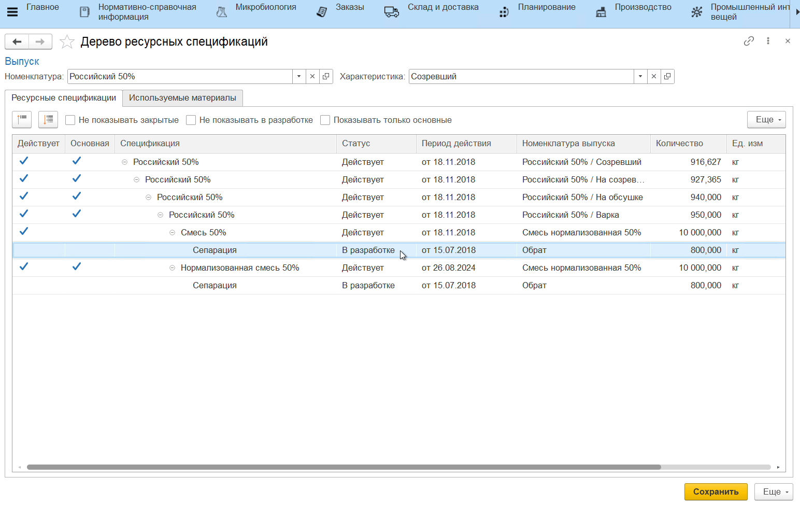

# Дерево ресурсных спецификаций

После того, как все спецификации созданы, они сохраняются в статусе *"В разработке"*, затем их необходимо утвердить и назначить основными. Это можно сделать сразу на форме работы со спецификацией либо с помощью обработки **"Дерево ресурсных спецификаций"**. Перейти к данной обработке можно из раздела "Производство" -> "Учет производства":

Также обработка доступна из справочника **"Ресурсные спецификации"**:

Обработка позволяет проанализировать цепочку спецификаций, начиная от выбранной продукции, проверить объемы выпусков по спецификациям и выбрать те спецификации, которые нужно назначить действующими и основными. Также можно рассчитать количество материалов, которое должно быть потрачено на выпуск продукции по основной цепочке спецификаций.

Первым шагом нужно выбрать номенклатуру и характеристику (если ведется учет по характеристикам), для которой нужно построить дерево спецификаций. После выбора дерево будет построено автоматически.

# Вкладка "Ресурсные спецификации"

В табличной части показывается:

- Спецификация;
- Статус спецификации;
- Период действия спецификации;
- Номенклатура выпуска по спецификации;
- Объем выпускаемой номенклатуры по спецификации, единица измерения.

Для дерева можно настроить фильтры:

- Не показывать закрытые - отбор по действующим спецификациям и спецификациям в разработке;
- Не показывать в разработке - отбор по действующим спецификациям;
- Показывать только основные - отбор по основным спецификациям.

Цепочку спецификаций также можно сворачивать до разных уровней:

На последнем примере видно, что для одной и той же номенклатуры выпуска (Смесь нормализованная 50%) действуют две спецификации, при этом только одна из них является основной. Для каждой из этих спецификаций построена своя цепочка разузлования по спецификациям полуфабрикатов. 

Для того, чтобы назначить спецификацию, которая находится в статусе *"В разработке"*, действующей, нужно дважды кликнуть по полю в колонке "Действует" и поставить галочку. Таким же образом можно назначить спецификацию основной. Затем нужно нажать **"Сохранить"**. После сохранения статус спецификации сменится, и дерево будет обновлено. 

!!! info "Важно"
    - Только действующую спецификацию можно назначить основной;
    - Спецификация начнет действовать с даты, которая указана в колонке "Период действия";
    - Можно утверждать сразу несколько спецификаций. Для этого отметьте галочками все спецификации, которые нужно назначить действующими, а затем сохраните;
    - Для одной номенклатуры выпуска может быть задана только одна основная спецификация:

# Вкладка "Используемые материалы"

В табличной части показывается:

- Какие номенклатуры входят в цепочку изготовления продукции на всех уровнях (прослеживаемость по материалам собирается только по основным спецификациям);
- Количество материала.

Для того, чтобы пересчитать количество материалов на другой объем выпуска, нужно указать плановый объем выпуска в поле *"Рассчитать от"*, тогда дерево будет пересчитано. Вернуться к изначальному варианту дерева можно по кнопке "Х" в поле *"Рассчитать от"*.

Отбор по типу воспроизводства "Покупка" покажет только те материалы, которые закупаются для производства выбранной продукции.

