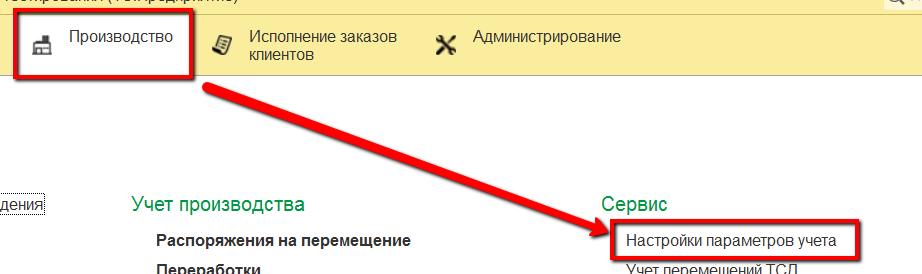

**Настройки учета в системе**
=============================

Перед стартом работы в MES-системе следует определить некоторые её
настройки, которые будут влиять на дальнейшее прохождение учета всего
производства.

 

 

Эти настройки находятся в панели "Настройка параметров учета":

 

**Вкладка "Основное".**

 

-   *Основной график работы предприятия* - указывается, по какому графику работает предприятие. Есть встроенный - общепринятый график работы на территории РФ.
-   *Контролировать остатки по производственным заданиям* -
    включает/отключает контроль остатков по производственным заданиям.  
    Нельзя выполнить сверхнормы по заданию (выпустить больше, чем
    указано), нельзя недовыполнить.
-   *Использовать штрих-коды складов для подтверждения перемещений* - включает/отключает при перемещении продукции на определенный склад необходимость не только просканировать, ЧТО перемещаем, но еще и КУДА. 
    Т.е. для склада будет  задан свой штрих-код, учет переммещения на него требует сканирования данного штрих-кода.
-   *Вести учет по сменам* - включает/отключает учет производства в несколько смен.  
    Например, две смены - с 00:00 до 08:00 и с 08:00 до
    24:00. Если отключен, то по умолчанию ведется учет по суточной смене: с 00:00 до 23:59.
-   *Вести учет по таре* - включает/отключает учет по тарам/контейнерам и т.п.
-   *Вид цен себестоимость* - цена, которая будет соответствовать
    себестоимости продукции. Этим видом производится установка плановой себестоимости и расчитывается фактическая.
-   *Формат времени нормы хранения* - ведет учет по норме хранения продукции на разных участках производства в часах или в минутах.
-   *Формировать итоговые документы за смену* - включает/отключает формирование и видимость документа "Акт переработки" - сборный документ по всем выпускам и расходам за смену на рабочем центре с учетом жира и белка в продукции и сырье.
-   *Склад пересчета* - склад, на который отправляются тары в случае инвентаризации, когда данные системы не сходятся с введенными пользователем данными о наличии тары на том или ином складе.
-   *Показатель плотности* - элемент справочника "Показатели номенклатуры", фактические значения которого используется в пересчете указанного объема в килограммы там, где это настроено.
-   *Префикс штрихкодов узла РИБ* - используется в случае распределенной базы для определения узла.

 

**Вкладка "Баланс жира и белка". Параметры учета**

 

-   *Номенклатура потерь* - "условная" номенклатура, без серий и
    характеристик, которая будет соответствовать потерям при сведении баланса по жиру и белку на разных участках производства.

 

**Единицы измерения**

-   *Вес* - основная единица измерения веса.

-   *Белкокилограммы* - единица измерения бкг (обычно создается, а не подбирается из классификатора).
-   *Жирокилограммы* - единица измерения жкг (обычно создается, а не подбирается из классификатора).

 

**Показатели анализов**

-   *М.д. белка* - показатель (элемент справочника "Показатели анализов номенклатуры), отвечающий за массовую долю белка в любой продукции.

-   *М.д. жира* - показатель (элемент справочника "Показатели анализов номенклатуры), отвечающий за массовую долю жира в любой продукции.

 

**Коэффициенты в расчете стоимости**

-   *Белок* - задает коэфициент стоимости белка.

-   *Жир* - задает коэфициент стоимости жира.
-   *Базисный белок, %* - нормативное значение белка в молочном сырье.
-   *Базисный жир, %* - нормативное значение жира в молочном сырье.

 

**Вкладка "Баланс жира и белка". Нормативы потерь**

 

В разрезе рабочих центров задаются нормативы потерь по кг, жкг и бкг в процентах.

