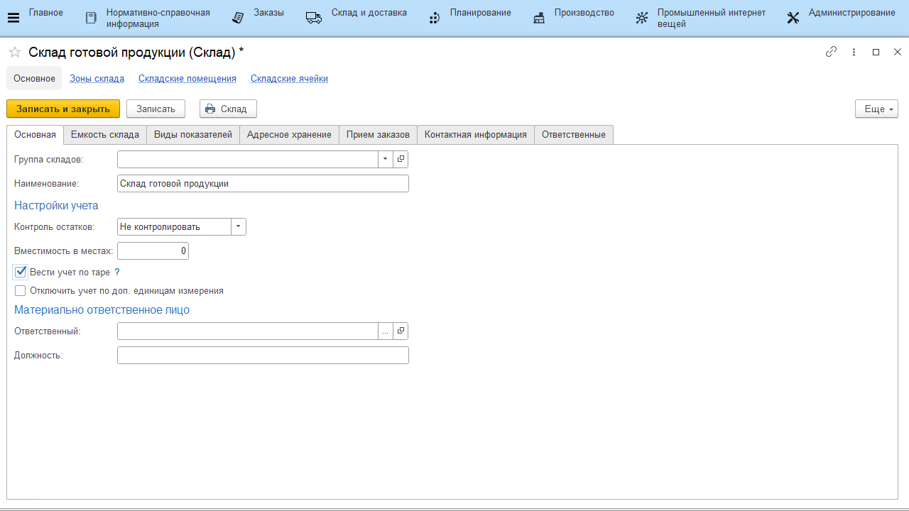
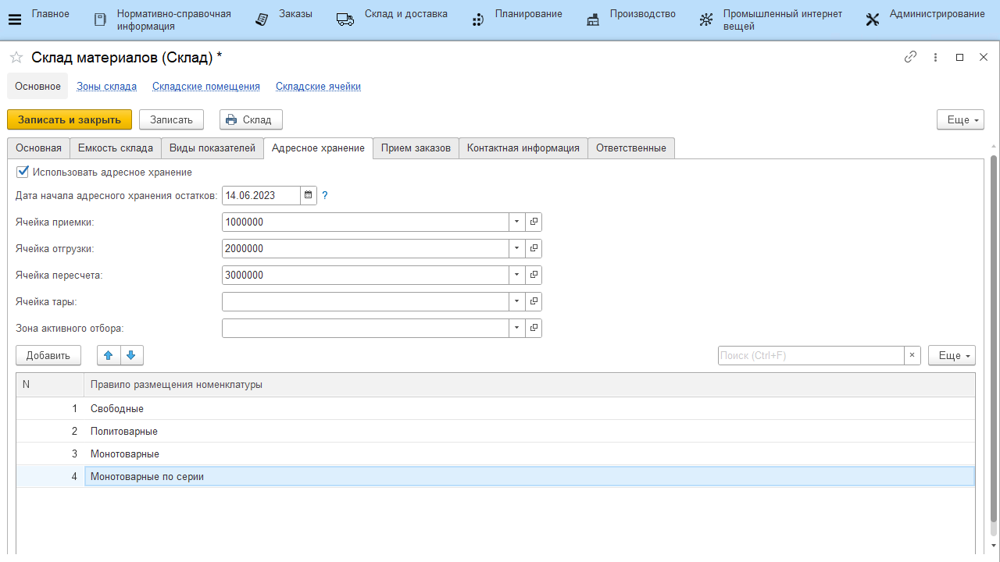

# Рабочие центры, виды рабочих центров и склады

Информация по автоматизируемым участкам производства хранится в справочнике "Рабочие центры", а по помещениям, которые к ним принадлежат (или используются в процессе производства) - в справочнике "Склады".

## Справочник "Склады"

**Вкладка "Основное"**

-   *Настройка контроля остатков* - включает/отключает контроль остатков.  
    Если контроль включен - не получится списать больше какого-либо материала, чем есть по учету в системе. Т.к. учет поступления материалов не всегда проходит оперативно, иногда целесообразно отключать такой контроль;

-   *Вместимость в местах* - позволяет указать вестимость по контейнерам;
-   *Вести учет по таре* - включает/отключает учет движений остатков в разрезе тары;
-   *Отключить учет по доп.единицам измерения* - включает/отключает учет по доп.единицам измерения. В случае отключения учета документы не двигают на этом складе регистры по доп.единицам (зануляют), только по основным.

**Вкладка "Виды показателей"**

Задается набор видов показателей склада и периодичность, с которой будут создаваться заявки на учет этих показателей в системе.

**Вкладка "Адресное хранение"**

Позволяет включать\\отключать деление склада на ячейки (ряды, стеллажи и прочее). [Настройка адресного хранения](../../../../../CommonInformation/Warehouse.md).

## Справочник "Рабочие центры"

**Вкладка "Склады"**

-   *Склады (склад) производства* - задается списком складов или одним складом (если он один), где ведется именно производственный учет - откуда берутся основные материалы, куда выпускается продукция;

-   *Склад материалов* - склад, откуда берутся вспомогательные материалы на этом участке производства.

**Вкладка "Производство"**

-   *Требуется обеспечение* - включает/отключает создание дополнительного производственного задания при создании задания на этот участок.  
    Пример - [создание задания на выпуск смеси под варки сыра](../../../SemiHardCheese/CookingCheese/TaskFormation/TaskFormation.md);
    
-   *Распределение материалов при сведении баланса* - включает/отключает операцию распределения материалов в рамках сведения баланса в закрытии смены.   
    Применяется для ПАЦ, когда на входе очень много партий молока, а на выходе, помимо выпусков смесей еще и выпуски полуфабрикатов. И при этом нужно делать в строгой последовательности - сначала распределить материал, а потом уже сводить баланс, иначе в
    баланс не попадают второстепенные выпуски;

## Справочник "Виды рабочих центров"

Вид рабочего центра заполняется на вкладке "Основное" рабочего центра и содержит настройки, которые будут применены автоматически к данному рабочему центру, при указании вида.

**Вкладка "Основное"**

- *Создавать производственное задание без партий* - включает/отключает автоматическое заполнении партий при создании документа "Производственное задание".
    Если включено, то партии заполняются в момент выпуска по созданному заданию;

- *Нумерация партий* - определяет, как создаются номера партий продукции, указанной в задании на этот участок:
    
    -   По виду рабочего центра внутри дня - партия будет заполняться автоматически при проведении производственного задания в формате "Дата смены/номер по порядку"(например: 01.01.2022/1). Для каждой номенклатуры нумерация отдельная.
    -   По настройкам вида номенклатуры - номер определяется настройками вида номенклатуры (см. раздел "[Виды номенклатуры](../KindOfNomenclature/KindOfNomenclature.md)").

