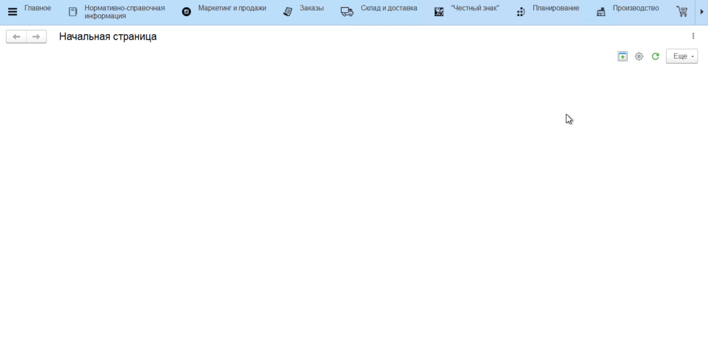
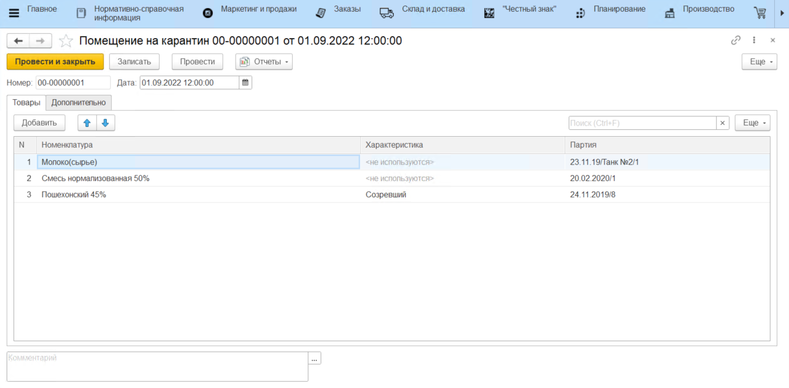
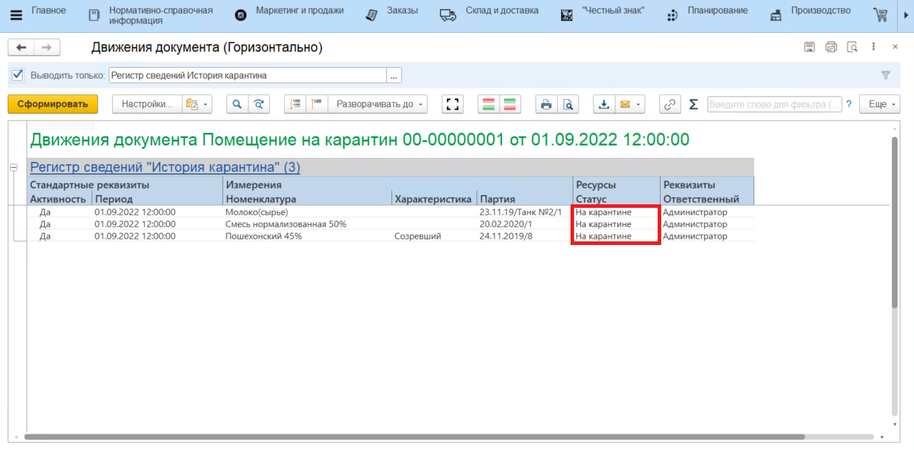

# Документ "Помещение на карантин"

Для помещения "**на карантин**" нужных партий товара можно воспользоваться документом **"Помещение на карантин"**, который располагается в разделе **"Производство"** подсистемы **"Управление качеством"**.

При заполнении данных необходимо заполнить следующие реквизиты:

 - Дата
 - Номенклатура
 - Характеристика *(опционально)*
 - Партия

После проведения документа в отчете **"Движения документа"** можно увидеть, что указанные позиции имеют **"Статус"** - **"На карантине"**

