# Закрытие смены

Контроль всех введенных в систему данных за рабочую смену осуществляется
мастером смены через "Рабочее место мастера смены". Закрытие смены на
участке сгущения и на участке сушки предполагает одинаковые действия,
только на соответствующих участках.

 

 

-   Открыть "Рабочее место мастера смены":  
    
    
-   Указать дату смены, смену и участок сушки сыворотки:  
      
    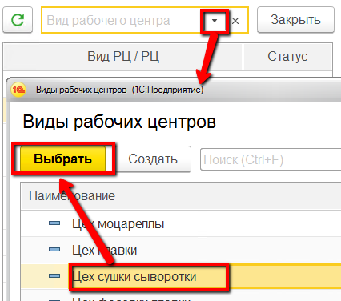
    
-   Выбрать участок сушки сыворотки:  
    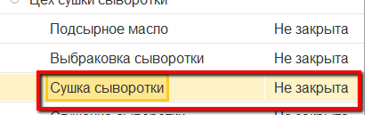
    
-   Справа заполнится различная информация за смену по участку.  
    Например, на вкладке "Выпуск" можно видеть все выпуски за смену:  
    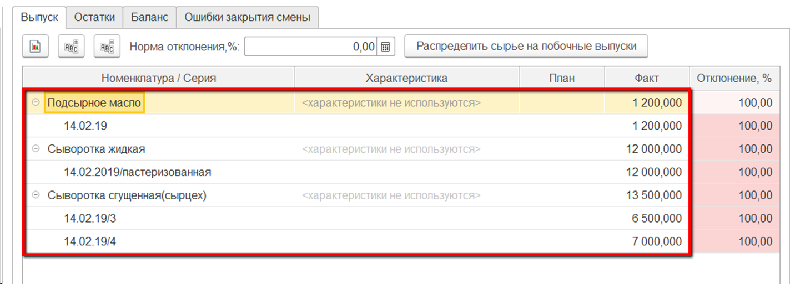
    
-   Перейти на вкладку "Остатки"-\>"Прочее". Здесь можно указать
    остатки жидкой сыворотки на конец смены.  
    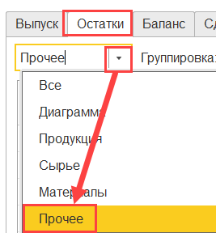
    
-   Для этого выбрать склад и нажать "Указать остаток":  
    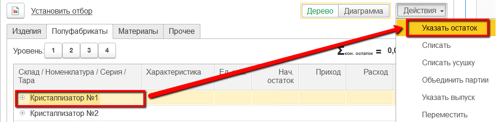
    
-   В открывшейся форме указать количество остатка и анализы, взятые в
    нем:  
    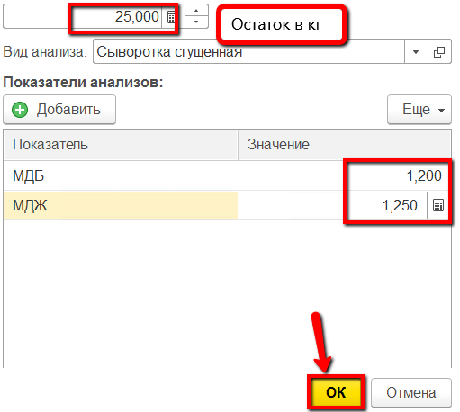
    
-   Т.к. все выпуски фиксировались без списания материалов, это действие
    нужно сделать в конце смены. Выполняется оно здесь же, на вкладке
    "Остатки"-\>"Полуфабрикаты".  
-   Выделить нужные партии сыворотки жидкой и списать их по кнопке
    "Списать":  
    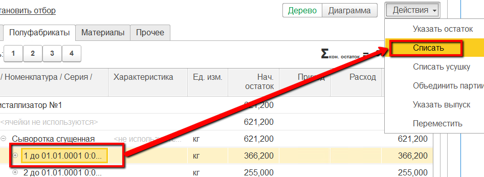
    
-   В открывшейся форме указать, что списание идет согласно отраслевой
    методике, и подтвердить:  
    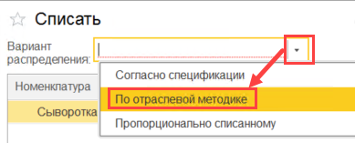
    
-   На вкладке "Баланс" можно свести или посмотреть ранее сведенный
    баланс по жиру и белку (если он уже был сведен, таблицы выпуска и
    материалов будут заполнены). Для сведения баланса на участке нажать
    "Свести баланс":  
    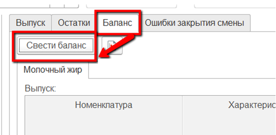  
    После - таблицы заполнятся. Для более удобного просмотра можно сформировать отчет, в котором будет отображена информация из таблиц.  
    Для этого нажать кнопку формирования отчета:  
    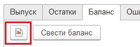
- Здесь можно видеть:
    -   Сколько какого продукта было выпущено, сколько при этом потратилось
        сырья;
    -   Какое было содержание жира и белка в сырье, какое получилось в
        выпусках (как в кг, так и в %);  
    -   Получившийся процент потерь по кг, жкг и бкг и нормативный.  
    
-   После выполнения всех вышеперечисленных действий и проверки корректности всех данных, смену необходимо закрыть для невозможности
    внесения в нее изменений. Для этого выбрать участок в таблице слева и нажать "Закрыть":  
    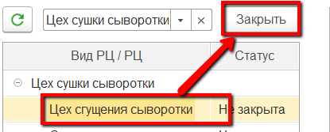
    
-   При закрытии могут возникнуть ошибки (не сведен баланс, не
    распределено сырье или т.п.) . Исправить их, после чего вернуться и
    снова нажать  "Закрыть".
    