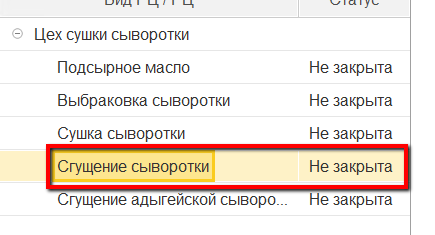
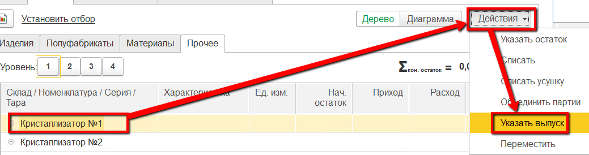
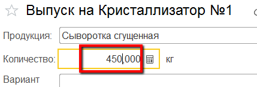
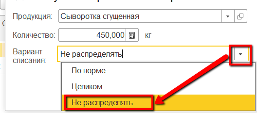

# Учет выпуска сгущенной сыворотки

Каждый выпуск сгущенной сыворотки на своем кристаллизаторе должен
фиксироваться отдельным выпуском в системе. Эту операцию мастер смены
может выполнить через свое рабочее место.

 

 

-   Открыть "Рабочее место мастера смены":  
    
     
-   Указать дату смены, смену и участок сушки сыворотки:  
      
    
     
-   Выбрать участок сгущения сыворотки:  
    
     
-   Перейти на вкладку "Остатки" -\> "Прочее" :  
    
     
-   Выбрать кристаллизатор, на который выпускается сыворотка. Нажать
    "Указать выпуск":  
    
     
-   Указать, что это выпуск сыворотки сгущенной и указать её количество:  
          
    
     
-   Указать, что при этом нет списания сыворотки жидкой (т.к. она будет
    списана в конце смены при наличии в системе показателей жира и белка
    по всем выпускам за смену) и подтвердить:  
    
