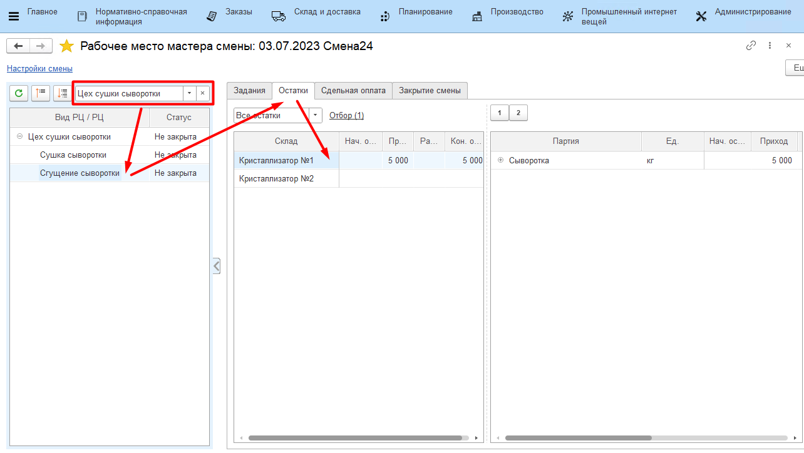
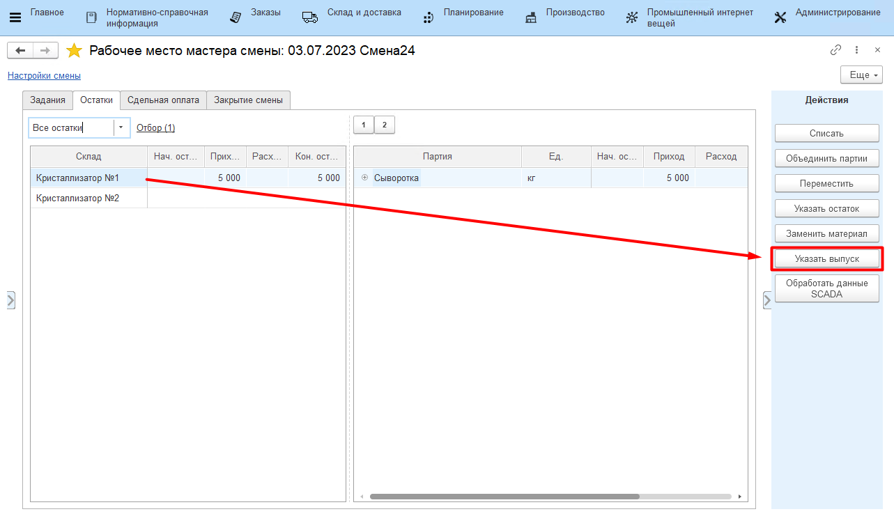
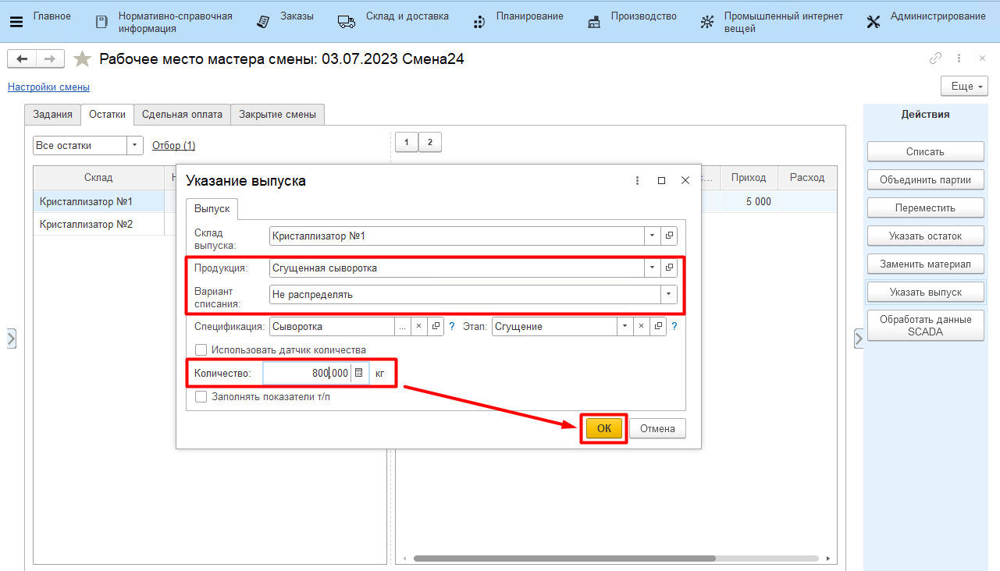

# Учет выпуска сгущенной сыворотки

Каждый выпуск сгущенной сыворотки на своем кристаллизаторе должен
фиксироваться отдельным выпуском в системе. Эту операцию мастер смены
может выполнить через свое рабочее место.

-   Открыть **"Рабочее место мастера смены"**;
-   Указать дату смены, смену и вид рабочего центра, к которому относится участок сушки сыворотки;
-   Выбрать участок сгущения сыворотки;
-   Перейти на вкладку *"Остатки"*;

-   Выбрать кристаллизатор, на который выпускается сыворотка. Нажать
    **"Указать выпуск"**;

-   Указать, что это выпуск сыворотки сгущенной и указать её количество;    
-   Указать, что при этом нет списания сыворотки жидкой (т.к. она будет
    списана в конце смены при наличии в системе показателей жира и белка
    по всем выпускам за смену) и подтвердить;

