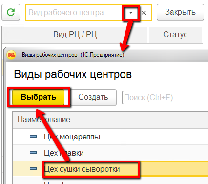
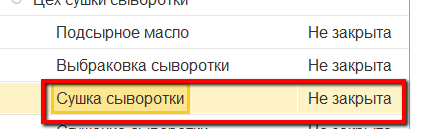
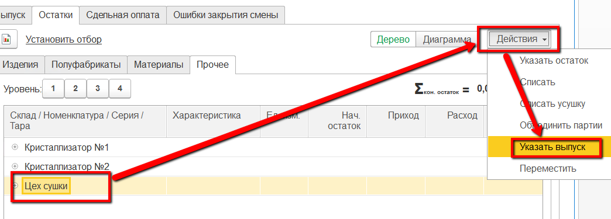
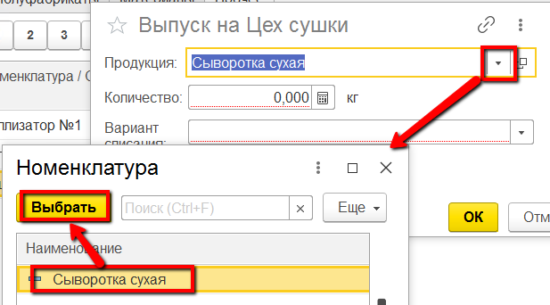
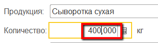
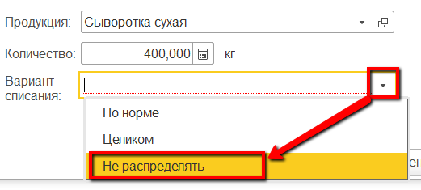

# Учет выпуска сухой сыворотки

Каждый выпуск сгущенной сыворотки на своем кристаллизаторе должен
фиксироваться отдельным выпуском в системе. Эту операцию мастер смены
может выполнить через свое рабочее место.

 

 

-   Открыть "Рабочее место мастера смены":  
    
     
-   Указать дату смены, смену и участок сушки сыворотки:  
      
    
     
-   Выбрать участок сушки сыворотки:  
    
     
-   Перейти на вкладку "Остатки" -\> "Прочее" :  
    
     
-   Выбрать цех сушки, на который выпускается сыворотка. Нажать "Указать
    выпуск":  
    
     
-   Указать, что это выпуск сыворотки сухой и указать её количество:  
       
    
     
-   Указать, что при этом нет списания сыворотки сгущенной (т.к. она
    будет списана в конце смены при наличии в системе показателей жира и
    белка по всем выпускам за смену) и подтвердить:  
    
