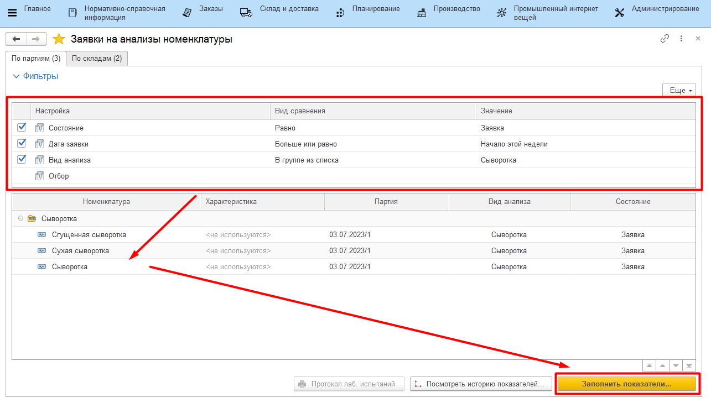
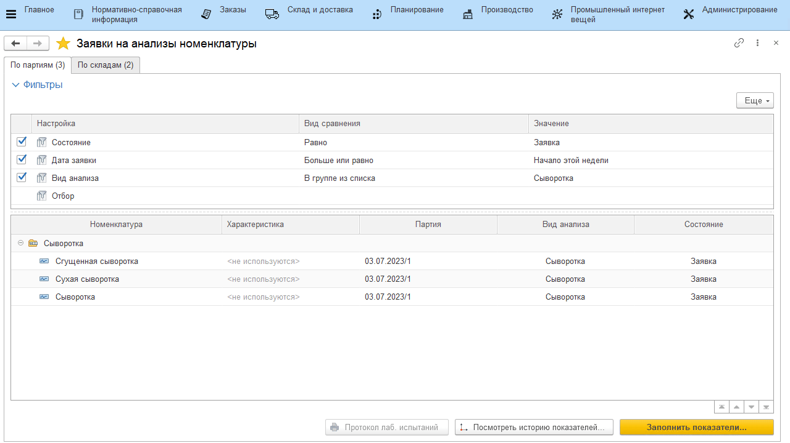

# Учет лабораторных анализов

Учет лабораторных анализов в системе происходит через обработку
**"Мониторинг выполнения лабораторных анализов"**.

-   Открыть **"Мониторинг выполнения лабораторных анализов"**;
-   Настроить фильтр так, чтобы в таблице отображались только нужные
    виды анализов:
    -   Период: в какой период пришли заявки на выполнение анализов;
    -   Состояние: "Заявка" - еще не был учтен в системе; "Выполнено" -
    учтен;
    -   Вид анализа: какие именно виды анализов будут заполняться с данного
    рабочего места;

-   В таблице ниже отобразятся все заявки, удовлетворяющие настроенным
    фильтрам. Они разделены по группам - по видам анализов. В первом
    столбце обозначается, на какой продукт идет заявка, во втором -
    партия. Нажать на строку, соответствующую анализу, показатели
    которого будут внесены, и нажать **"Заполнить показатели"**:     
-   На вкладке *"Результаты анализов"* заполнить столбец "Значение
    показателя" напротив каждого из показателей в соответствии с
    проведенным анализом;
-   Нажать **"Провести и закрыть"**.

